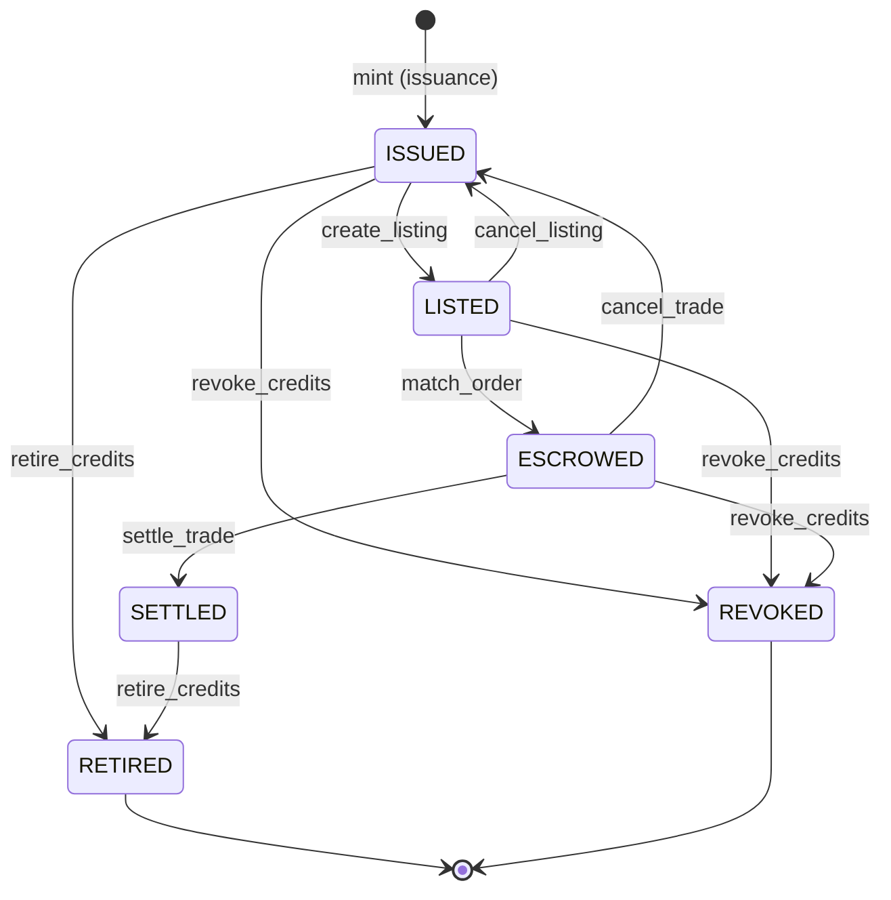
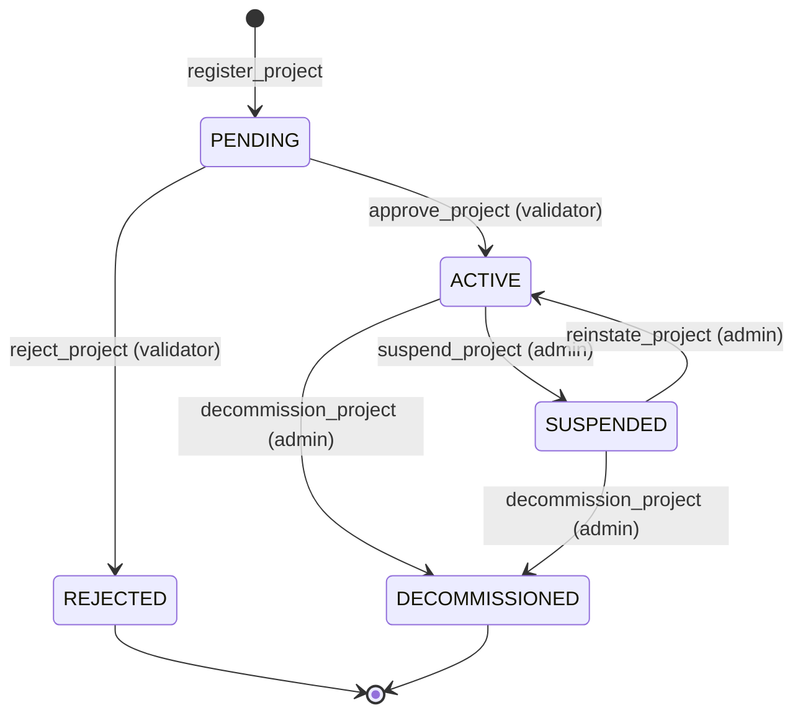

# Design Document: Carbon Credit Lifecycle Protocol Specification

## Overview

This document describes the design of `docs/protocol/carbon-credit-lifecycle.md` — a comprehensive, implementation-independent protocol specification for the StellarKraal carbon credit lifecycle. The artifact is a Markdown document, not implementation code. The design describes the document's structure, the content of every section, the conventions used for Mermaid diagrams and formal tables, and the cross-referencing strategy for contract invariants.

The protocol runs across four Soroban smart contract crates:

| Contract Crate | File | Role |
|---|---|---|
| `carbon_registry` | `contracts/carbon_registry/src/lib.rs` | Project and credit registry — serial numbers, lifecycle state transitions |
| `carbon_credit` | `contracts/carbon_credit/src/lib.rs` | SEP-41 token — mint, burn, transfer of credit tokens |
| `carbon_marketplace` | `contracts/carbon_marketplace/src/lib.rs` | Order matching, escrow, and settlement |
| `carbon_oracle` | `contracts/carbon_oracle/src/lib.rs` | Price feeds from Xpansiv/Toucan |

---

## Document Structure Design

The output file `docs/protocol/carbon-credit-lifecycle.md` has the following top-level sections:

```
1. Introduction
2. Out of Scope
3. Glossary
4. Lifecycle Operation: Project Registration
5. Lifecycle Operation: Credit Issuance
6. Lifecycle Operation: Marketplace Listing
7. Lifecycle Operation: Order Matching
8. Lifecycle Operation: Settlement
9. Lifecycle Operation: Credit Retirement
10. Lifecycle Operation: Credit Revocation
11. State Machines
12. Protocol Invariants
13. Property-Based Testing Guide
14. Known Limitations and Design Rationale
15. Related Documents
16. Revision History
```

Each lifecycle operation section (§4–§10) follows a uniform sub-structure:

```
### <Operation Name>
#### Overview
#### Actors
#### Precondition Table
#### Postcondition Table
#### Flow Description
#### Error Catalogue
#### Events Emitted
```

---

## Section Content Design

### § 1 Introduction

States that:
- The document is implementation-independent — an independent team could reimplement the protocol from it.
- The four contract crates are the normative reference implementation.
- The document version is `1.0.0-draft` with status `DRAFT`.
- Sections cross-reference each other using Markdown anchor links.

### § 2 Out of Scope

Explicitly excludes:
- REST API reference documentation (covered by separate API spec)
- Implementation code, pseudocode, or algorithmic detail
- Provider selection for KYC/AML (covered by `docs/compliance/kyc-aml-design.md`)
- Deployment pipeline and DevOps concerns
- Frontend or wallet UX

### § 3 Glossary

Defines all terms required by Requirement 9.1 in alphabetical order. Each entry has:
- **Term** (bold, anchor link target)
- Definition sentence
- Where applicable: cross-reference to the contract field or event that uses the term

Terms defined: Additionality, AML Status, Buffer Pool, Carbon Credit, Carbon_Credit_Contract, Carbon_Marketplace_Contract, Carbon_Oracle_Contract, Carbon_Registry_Contract, Counterparty Risk, Credit Batch, Credit State, Escrow, KYC Status, Ledger Sequence, Methodology, Order, Permanence, Project, Project_State, Protocol_Spec, Retirement, Revocation, Serial Number, Settlement, Validator, Vintage.

### §§ 4–10 Lifecycle Operations

Each operation follows the uniform sub-structure described above.

#### Precondition / Postcondition Table Format

```markdown
| # | Condition | Actor | Contract | Notes |
|---|-----------|-------|----------|-------|
| PRE-1 | Project state is ACTIVE | Issuer | carbon_registry | Enforced by `require_active_project` guard |
```

- **PRE-n** rows use condition language: "X is Y", "X exists", "X does not exceed Y"
- **POST-n** rows use effect language: "X is now Y", "X has been emitted", "X has been decremented by Q"
- Minimum 3 PRE + 3 POST per operation per Requirement 8.3

#### Error Catalogue Format

```markdown
| Error Code | Typed Name | Trigger Condition | HTTP Equivalent |
|---|---|---|---|
| E-REG-001 | DuplicateProjectId | project_id already exists in registry | 409 Conflict |
```

#### Events Emitted Format

```markdown
| Event Name | Schema Version | Fields | Emitting Contract |
|---|---|---|---|
| ProjectRegistered | 1 | project_id, developer_addr, methodology_ref, ledger_seq | carbon_registry |
```

---

## State Machine Design (§ 11)

### Credit State Machine

**States:** `ISSUED`, `LISTED`, `ESCROWED`, `SETTLED`, `RETIRED`, `REVOKED`

**Valid transitions (complete set):**

| From | To | Trigger | Actor |
|---|---|---|---|
| ISSUED | LISTED | create_listing | Credit holder |
| LISTED | ESCROWED | match_order | Marketplace (automated) |
| LISTED | ISSUED | cancel_listing | Seller |
| ESCROWED | SETTLED | settle_trade | Marketplace (automated) |
| ESCROWED | ISSUED | cancel_trade (timeout) | Either party |
| ISSUED | RETIRED | retire_credits | Credit holder |
| SETTLED | RETIRED | retire_credits | New owner |
| ISSUED | REVOKED | revoke_credits | Admin / Validator |
| LISTED | REVOKED | revoke_credits | Admin / Validator |
| ESCROWED | REVOKED | revoke_credits (with escrow cancellation) | Admin / Validator |

Any transition not listed above is **invalid** and SHALL be rejected.

**Mermaid diagram:**



### Project State Machine

**States:** `PENDING`, `ACTIVE`, `SUSPENDED`, `DECOMMISSIONED`

**Valid transitions:**

| From | To | Trigger | Actor |
|---|---|---|---|
| PENDING | ACTIVE | approve_project | Registered validator |
| PENDING | REJECTED | reject_project | Registered validator |
| ACTIVE | SUSPENDED | suspend_project | Admin |
| SUSPENDED | ACTIVE | reinstate_project | Admin |
| ACTIVE | DECOMMISSIONED | decommission_project | Admin |
| SUSPENDED | DECOMMISSIONED | decommission_project | Admin |

**Mermaid diagram:**



---

## Protocol Invariants Design (§ 12)

Eight named invariants, each in a uniform table entry:

| # | Invariant Name | Formal Statement | Contract | Entry Point | File:Lines |
|---|---|---|---|---|---|
| INV-1 | Supply Conservation | `total_supply_after_mint == total_supply_before + quantity` | carbon_credit | `mint` | `contracts/carbon_credit/src/lib.rs:TBD` |
| INV-2 | Serial Number Uniqueness | `∀ (p,v,s): (project_id=p ∧ vintage=v ∧ serial=s) is unique` | carbon_registry | `issue_credits` | `contracts/carbon_registry/src/lib.rs:TBD` |
| INV-3 | State Machine Legality | Only transitions in the valid set are applied | carbon_registry / carbon_marketplace | `*` | both files |
| INV-4 | Escrow Balance Conservation | `Σ(escrowed_credits) + Σ(circulating_credits) == total_supply` | carbon_marketplace | `match_order`, `settle_trade`, `cancel_trade` | `contracts/carbon_marketplace/src/lib.rs:TBD` |
| INV-5 | Retirement Irreversibility | `RETIRED → X` is never applied for any X | carbon_registry | `retire_credits` | `contracts/carbon_registry/src/lib.rs:TBD` |
| INV-6 | Revocation Authority | Only `admin_address` or a delegated validator with `REVOCATION_AUTHORITY` flag may call `revoke_credits` | carbon_registry | `revoke_credits` | `contracts/carbon_registry/src/lib.rs:TBD` |
| INV-7 | Oracle Staleness Enforcement | `current_ledger - oracle_last_updated <= max_age_ledgers` at every listing and match | carbon_marketplace | `create_listing`, `match_order` | `contracts/carbon_marketplace/src/lib.rs:TBD` |
| INV-8 | Order Replay Prevention | `H(contract_id ‖ network_passphrase ‖ expiry_ledger ‖ order_payload)` is unique per accepted order | carbon_marketplace | `create_listing`, `match_order` | `contracts/carbon_marketplace/src/lib.rs:TBD` |
| INV-9 | Issuance-Retirement-Revocation Conservation | `revoked_qty + retired_qty ≤ issued_qty` per project, per vintage | carbon_registry | `revoke_credits`, `retire_credits` | `contracts/carbon_registry/src/lib.rs:TBD` |

> **Note on line ranges:** The `:TBD` placeholders are resolved when the spec author walks each contract source file during the authoring pass. They are not left as TBD in the final published document. See the authoring tasks in `tasks.md`.

---

## Property-Based Testing Guide Design (§ 13)

One PBT opportunity per lifecycle operation:

| Operation | Invariant Under Test | Input Domain | Property Type |
|---|---|---|---|
| Project Registration | Duplicate ID rejection | Generate random project IDs, submit same ID twice | Error-condition |
| Credit Issuance | Supply conservation (INV-1) | Generate random quantities ∈ [1, 1e9], mint N times | Round-trip: `supply_after = supply_before + sum(quantities)` |
| Marketplace Listing | Oracle staleness gate (INV-7) | Generate `last_updated` values spanning [0, max_age_ledgers + 1000] | Metamorphic: listing accepted iff `age ≤ max_age_ledgers` |
| Order Matching | Wash-trading prevention | Generate buy and sell orders, vary buyer==seller | Error-condition: same-address match is always rejected |
| Settlement | Atomic DVP conservation | Generate matched trades; simulate random failure modes | Round-trip: on failure, `escrowed_credits + escrowed_usdc == pre-escrow values` |
| Credit Retirement | Retirement irreversibility (INV-5) | Generate retired serial numbers; attempt all operations on each | Error-condition: every post-retirement operation is rejected |
| Credit Revocation | Conservation invariant (INV-9) | Generate arbitrary issuance/retirement/revocation sequences | Metamorphic: `revoked + retired ≤ issued` always holds |

---

## Known Limitations and Design Rationale Design (§ 14)

### Single-Admin-Key Centralization Risk
The revocation entry point is gated on a single `admin_address` (plus delegated validators). A compromised admin key can revoke any credit. Mitigations: multisig admin via Stellar's multi-sig support, time-locked revocations, on-chain governance — all deferred as future work (tracked in Issue #2 and Issue #4).

### Oracle Staleness Window Trade-off
`max_age_ledgers` is a configurable parameter. A tight window reduces price manipulation risk but increases the chance of legitimate listings failing during oracle bridge outages. Default value is chosen to tolerate one missed oracle update cycle. Liveness guarantee for the oracle bridge is addressed separately in `docs/issues/03-oracle-data-integrity.md` Issue #12.

### Replay Attack Prevention
Orders are domain-separated using `H(contract_id ‖ network_passphrase ‖ expiry_ledger ‖ payload)` — analogous to EIP-712 but adapted for Soroban's XDR-native auth model. Full design in `docs/protocol/order-signing.md` (Issue #3). Using the Stellar network passphrase prevents testnet orders from being replayed on mainnet.

### KYC/AML Threshold Configuration
Thresholds are environment-variable-driven (`KYC_TRADE_THRESHOLD_USD`, `KYC_RETIREMENT_THRESHOLD_USD`). The default values ($1,000 and $3,000) are informed by FATF and US FinCEN/BSA guidelines but are **not** legal compliance guarantees. Full KYC/AML architecture in `docs/compliance/kyc-aml-design.md`.

### Cross-Contract Reentrancy Model
Soroban's host environment prevents classical EVM-style reentrancy (no recursive call stack). However, cross-contract call ordering and auth-context propagation still require explicit design. The spec mandates that all state transitions are committed before any external token transfer calls are initiated (INV-3 + Requirement 5.8). Full audit in Issue #2 (`docs/issues/01-smart-contract-security.md`).

### Buffer Pool Percentage Precision
Buffer pool percentages are stored and validated to two decimal places (0.01–100.00%). Rounding is truncated toward zero to avoid over-withholding. Edge case: a 0% buffer pool is semantically equivalent to no buffer pool configuration.

---

## Related Documents Design (§ 15)

| Document | Path | Relationship |
|---|---|---|
| KYC/AML Integration Design | `docs/compliance/kyc-aml-design.md` | Defines KYC/AML thresholds referenced in §6, §7 of the spec |
| Smart Contract Security Issues | `docs/issues/01-smart-contract-security.md` | Issues 1–5: fuzz testing, reentrancy audit, replay prevention, invariant spec, upgrade safety |
| Oracle Data Integrity Issues | `docs/issues/03-oracle-data-integrity.md` | Oracle liveness and price manipulation issues referenced by INV-7 |
| Order Signing Protocol | `docs/protocol/order-signing.md` | Domain-separated order signing design (to be created, Issue #3) |

---

## Authoring Conventions

### Normative Language
- **SHALL** — mandatory requirement
- **SHALL NOT** — prohibition
- **SHOULD** — recommended but not mandatory
- **MAY** — optional

### EARS Patterns Used
- `WHEN <trigger>, THE <system> SHALL <response>` — event-driven
- `IF <condition>, THEN THE <system> SHALL <response>` — unwanted situation
- `WHILE <state>, THE <system> SHALL <behaviour>` — state-driven
- `WHERE <feature>, THE <system> SHALL <response>` — optional feature

### Cross-Reference Convention
Contract cross-references use the format: `[contract_name:entry_point](contracts/<crate>/src/lib.rs#L<start>-L<end>)`. Line ranges are resolved during authoring. Until resolved, `:TBD` is used as a placeholder.

### Mermaid Diagrams
- State diagrams use `stateDiagram-v2`
- Flow diagrams use `flowchart TD`
- All diagrams are self-contained (no external references)
- Diagram labels use the exact state/event names defined in the Glossary

### Versioned Events
All events include a `schemaVersion: u32` field (positive integer ≥ 1). The current schema version for all events in this revision is `1`.

---

## File Location

```
docs/
└── protocol/
    └── carbon-credit-lifecycle.md   ← OUTPUT ARTIFACT
```

The `docs/protocol/` directory is created if it does not already exist.
