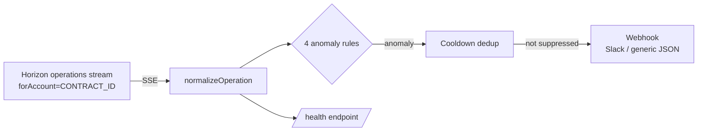

# On-Chain Anomaly Detection & Alerting

Closes #34.

The monitoring service (`src/monitoring/`, containerized via `monitoring/Dockerfile`
and `docker-compose.yml`) subscribes to the Stellar Horizon **operations** stream
scoped to `CONTRACT_ID`, decodes every `invoke_host_function` call against it, and
evaluates each one against a set of anomaly rules. Anomalies that survive
cooldown-based deduplication are posted to a webhook (Slack incoming webhook or a
generic JSON receiver, e.g. a PagerDuty Events API v2 proxy).

It is a separate, independently deployable process from the main backend API — it
does not require `JWT_SECRET`, `SERVER_SECRET_KEY`, or `DATABASE_URL`, and its
failure or restart has no effect on loan/collateral request handling.

## How it works



Horizon indexes a Soroban contract's `C...` address as a participant on any
`invoke_host_function` operation that touches it, so `GET
/operations?account=CONTRACT_ID` returns exactly that contract's activity as a
live SSE feed — no polling. `includeFailed(true)` is set so failed
transactions (contract errors) are included, since Horizon excludes them by
default.

Note: the subscriber does **not** use the SDK's `.forAccount(id)` builder
method. That method targets the REST-nested `/accounts/{id}/operations` route,
and that route validates `account_id` as a classic G-address — it rejects
contract addresses with `400 Bad Request` (confirmed against a live testnet
Horizon instance while building this service). Only the flat
`/operations?account=` form accepts a contract ID, so
`src/monitoring/horizon/stream.ts` sets that query parameter directly.

Horizon flattens the invocation's arguments into `parameters: [contractAddress,
functionNameSymbol, ...args]` (base64 XDR `ScVal`s); `src/monitoring/horizon/normalize.ts`
decodes these into a `NormalizedInvocation` that every rule consumes.

## Rules

All thresholds are environment-variable-driven — see `.env.example` for the full
list and defaults. Every rule receives `successful: false` invocations too, so
failed calls are visible to whichever rules care about them.

### 1. Large value invocation — `large-value-invocation`

**File:** `src/monitoring/rules/largeValue.rule.ts`

Flags a call to a configured "value-moving" function whose largest numeric
argument (normalized from the contract's 7-decimal fixed-point convention, e.g.
`principal / 1e7` as used elsewhere in this codebase) exceeds a threshold. This
is the proxy for "abnormally large credit retirements / wash-trading" from the
issue: in this codebase's current contract, the closest analogue is an
oversized `mint_collateral` call, but it's driven entirely by
`LARGE_VALUE_FUNCTIONS`, so it applies to any future value-moving entry point
(e.g. a retirement/burn function) without a code change.

| Variable | Default | Meaning |
|---|---|---|
| `LARGE_VALUE_FUNCTIONS` | `mint_collateral` | Comma-separated function names to watch |
| `LARGE_VALUE_THRESHOLD` | `50000` | Absolute value above which an invocation is flagged |

**Recommended response:** Confirm the transaction against the borrower/asset
record it corresponds to off-chain. If it's not a legitimate appraisal, treat it
as a potential wash-trading / oracle manipulation incident: freeze the
associated loan from further on-chain state changes and escalate to the oracle
operator on call.

### 2. Oracle price deviation — `oracle-price-deviation`

**File:** `src/monitoring/rules/oracleDeviation.rule.ts`

Maintains a rolling window (last 50 samples) of observed values per
`contractId:functionName`, and flags a new value once at least
`ORACLE_DEVIATION_MIN_SAMPLES` prior samples exist and the new value deviates
from their mean by more than `ORACLE_DEVIATION_THRESHOLD_PCT`.

| Variable | Default | Meaning |
|---|---|---|
| `ORACLE_PRICE_FUNCTIONS` | `mint_collateral,set_price` | Functions whose values feed the rolling baseline |
| `ORACLE_DEVIATION_THRESHOLD_PCT` | `20` | Deviation from the rolling mean, in percent, that triggers an alert |
| `ORACLE_DEVIATION_MIN_SAMPLES` | `3` | Minimum prior samples required before deviation is evaluated |

**Recommended response:** Cross-check the flagged price/appraisal against an
independent source (a second oracle feed, or the ADR-006 multi-oracle median if
available). If the feed is corrupted or compromised, pause oracle-dependent
operations (new collateral mints) until the feed is confirmed healthy or a
recovery oracle is promoted.

### 3. Unauthorized entry-point call — `unauthorized-entry-point`

**File:** `src/monitoring/rules/unauthorizedEntryPoint.rule.ts`

Fires on two distinct conditions:

1. **Any invocation whose transaction failed on-chain** (a contract error) —
   always evaluated, regardless of function or caller.
2. **A privileged function invoked by a source account outside an allowlist** —
   only enforced once `ALLOWED_INVOKER_ACCOUNTS` is non-empty, so it's opt-in
   until an operator configures the known-good caller set (e.g. the backend's
   oracle server account).

| Variable | Default | Meaning |
|---|---|---|
| `PRIVILEGED_FUNCTIONS` | `mint_collateral,set_price` | Functions subject to allowlist enforcement |
| `ALLOWED_INVOKER_ACCOUNTS` | *(empty)* | Comma-separated G-addresses permitted to call `PRIVILEGED_FUNCTIONS`; empty disables allowlist enforcement (failures are still flagged) |

**Recommended response:** For a contract error, check whether it's an expected
user-facing failure (e.g. insufficient collateral) or a sign of exploit
attempts probing the contract. For a non-allowlisted privileged caller, treat
as a credential compromise: rotate `SERVER_SECRET_KEY` and audit recent
transactions from that account immediately.

### 4. Transaction volume spike — `transaction-volume-spike`

**File:** `src/monitoring/rules/volumeSpike.rule.ts`

Buckets invocations into fixed-size time windows (`VOLUME_WINDOW_SECONDS`) and
flags a window whose count both clears an absolute floor
(`VOLUME_SPIKE_MIN_COUNT`, to avoid noise when the trailing baseline is near
zero) and exceeds the trailing average of the last `VOLUME_BASELINE_WINDOWS`
windows by `VOLUME_SPIKE_MULTIPLIER`.

| Variable | Default | Meaning |
|---|---|---|
| `VOLUME_WINDOW_SECONDS` | `60` | Bucket size for volume counting |
| `VOLUME_BASELINE_WINDOWS` | `10` | Number of trailing windows averaged into the baseline |
| `VOLUME_SPIKE_MULTIPLIER` | `3` | How many times the baseline a window must exceed to trigger |
| `VOLUME_SPIKE_MIN_COUNT` | `10` | Minimum operations in a window before the multiplier check applies |

**Recommended response:** A sudden spike can be legitimate (a marketing push,
a bulk operation) or a bot/exploit hammering an entry point. Check the
distribution of source accounts and functions in the flagged window; if it's
concentrated on one account/function, consider rate-limiting or, in a severe
case, pausing the contract via its admin controls.

## Alert deduplication

`src/monitoring/alerting/dedup.ts` tracks the last time each anomaly's
`dedupKey` fired (a rule-specific identity, e.g. rule + contract + function +
account) and suppresses repeats within `ALERT_COOLDOWN_SECONDS` (default 900 =
15 minutes). This means a persistently anomalous condition (e.g. a sustained
volume spike) alerts once per cooldown window rather than once per operation.

## Alert payload

Every alert includes: the rule that fired, severity, contract ID, transaction
hash, ledger, function name, source account, and the observed value vs. the
configured threshold. See `src/monitoring/alerting/webhook.ts` for the exact
Slack block / generic JSON shapes.

## Running it

```bash
# local dev
npm run monitor

# production build
npm run monitor:build && npm run monitor:start

# Docker Compose
docker compose up --build monitoring
```

`GET http://localhost:$MONITOR_PORT/health` returns `200` when the Horizon
stream is connected and the last processed event's on-chain-to-processed lag
is within `MAX_EVENT_LAG_MS` (default 10s, matching the ≤10s real-time
processing requirement), or `503` otherwise.

## Known limitations

- Value extraction (rules 1 and 2) is a generic heuristic — it scans decoded
  arguments for the numeric leaf with the largest magnitude, because the
  monitoring service doesn't have access to the contract's Rust source to know
  a fixed argument position for "the value." If a specific contract's ABI is
  known, replace `extractLargestNumericArg` in `src/monitoring/rules/common.ts`
  with positional extraction for tighter precision.
- The monitoring service shares this repository's root `package.json`/lockfile
  for simplicity; its Docker image only installs and ships what it needs at
  the `dist/monitoring` output level, but the `npm ci` layer still pulls in
  the full backend's production dependencies. Splitting it into a standalone
  package is a reasonable follow-up if image size becomes a concern.
