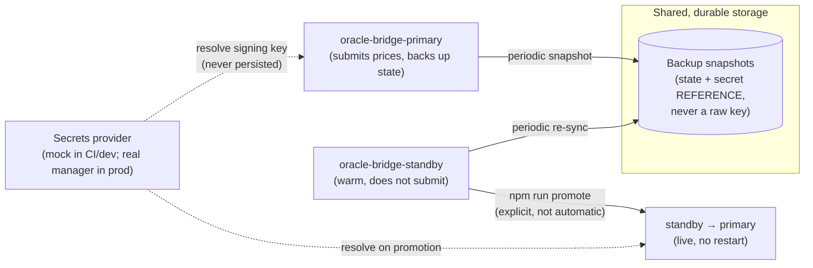

# Oracle Bridge — Disaster Recovery Runbook

| | |
|---|---|
| **Status** | Active |
| **Owner** | Whoever runs the quarterly drill — see [Quarterly Checklist](#quarterly-checklist) |
| **Automated drill** | `oracle-bridge/scripts/drill.sh` |
| **CI coverage** | `.github/workflows/oracle-bridge-dr.yml` |
| **Related** | `docs/security/threat-model.md` (OR-01, OR-02 — oracle key concentration and rotation gaps this DR design does not itself resolve) |

## Overview

The oracle bridge is the process that signs and submits price data to the StellarKraal Soroban contract. It is a single point of failure by nature: whoever holds its signing key is the only party who can submit prices, so if that one process goes down, price submission stops entirely.

This runbook covers the primary/standby setup under `oracle-bridge/` and `docker-compose.yml`, what to do when the automated drill fails, and the quarterly validation process required to keep confidence in all of the above.

### Architecture at a glance



Key properties, and why:

- **A backup snapshot never contains a raw private key** — only a *reference* string (`SIGNING_KEY_SECRET_REF`, e.g. a secrets-manager ARN). The raw key is resolved in memory, on demand, through a `SecretsProvider`, and is never written to state, logs, or a backup file. See `oracle-bridge/src/secretsProvider.ts`.
- **Promotion is explicit, not automatic.** Nothing fails over silently. A human (or an automated drill/monitor, if one is added later) decides to run `npm run promote` against the standby. This is a deliberate choice: automatic failover on a funds-adjacent, price-submitting process risks a split-brain where both instances briefly believe they're primary.
- **Promotion is live — no restart required.** The standby's own loop checks, on every tick, whether it has already been promoted (its on-disk state flipped to `primary` by an external `npm run promote`), and switches its own behavior over immediately if so. This is what the drill script measures.

## Prerequisites

- Docker and Docker Compose v2 (`docker compose version`).
- Node.js 20+ and `npm` if running `oracle-bridge/` outside Docker.
- For a **real** deployment (not CI/local dev): a provisioned secrets manager entry for the oracle signing key, and an implemented `SecretsProvider` for it — see [Secrets and the mock provider](#secrets-and-the-mock-provider). This repository ships a **mock provider only**; wiring a real one is a prerequisite for production use, not something this runbook can complete for you.

## Automated Drill

Run from the repository root:

```bash
docker compose build
./oracle-bridge/scripts/drill.sh
```

What it does:

1. Brings up `oracle-bridge-primary` and `oracle-bridge-standby`.
2. Waits for the primary to be healthy and to have taken at least one backup.
3. Waits for the standby to be healthy (and warm-synced).
4. **Simulates primary failure**: `docker compose stop oracle-bridge-primary`.
5. Runs `docker compose exec oracle-bridge-standby npm run promote`.
6. Waits for the standby to report `role: primary` via its `/health` endpoint.
7. Prints the measured elapsed time and asserts it's under **15 minutes** (900 seconds) — the acceptance budget. In practice this completes in single-digit seconds; the 15-minute figure is the budget, not the target.

A separate, faster check verifies the backup → restore path in isolation (no Docker, mock secrets, run on every PR):

```bash
cd oracle-bridge
npm run build
./scripts/backup-restore-check.sh
```

This starts a primary, waits for a backup, kills it, restores that backup into a **brand new** state directory, starts a fresh instance from it, and confirms its `/health` endpoint reports the expected contract ID — i.e. restoring from backup produces an instance that actually works, not just a JSON file that parses.

## Manual Procedure (if the automated drill fails)

If `drill.sh` fails or isn't available (e.g. Docker itself is down), promote a standby by hand:

### 1. Confirm the primary is actually down

```bash
curl -sf http://<primary-host>:4000/health || echo "primary unreachable"
```

Don't promote a standby while the primary is still actually serving — you'd end up with two primaries submitting prices independently (split-brain).

### 2. Confirm the standby has a recent backup to promote from

```bash
docker compose exec oracle-bridge-standby sh -c 'cat /data/backups/latest.json'
```

Check the `state.updatedAt` timestamp inside — if it's unexpectedly old, the standby's warm-sync loop may itself have stopped; check its logs (`docker compose logs oracle-bridge-standby`) before proceeding.

### 3. Promote

If the standby container is still running (the common case — only the primary died):

```bash
docker compose exec oracle-bridge-standby npm run promote
```

Then poll its health until `role` flips to `primary`:

```bash
watch -n 2 curl -sf http://<standby-host>:4001/health
```

If the standby container is **also** unavailable and you're standing up a replacement on new infrastructure instead:

```bash
# On the new instance, pointed at the same shared BACKUP_DIR:
BRIDGE_ROLE=primary STATE_DIR=./data/state BACKUP_DIR=<shared backup location> \
  CONTRACT_ID=<contract id> SIGNING_KEY_SECRET_REF=<real secret reference> \
  SECRETS_PROVIDER=<your real provider> \
  npm run promote
npm start
```

`npm run promote` restores the latest backup into `STATE_DIR` and flips its role to `primary` *before* the process starts, so `npm start` immediately comes up in primary mode.

### 4. Verify signing actually works

`promote` already resolves the signing key once (to prove it's reachable) as part of promotion — if that step failed, promotion itself would have failed with a clear error naming the secret reference that couldn't be resolved. If promotion succeeded but you want to double check post-promotion, look for `"Submission loop failed"` (bad) vs. successful `"Price submitted on-chain"` / `"DRY_RUN: would submit price"` log lines (good) in the newly-primary instance's logs.

### 5. Stand up a new standby

The old primary (once recovered) or a fresh instance should be started with `BRIDGE_ROLE=standby` pointed at the same shared `BACKUP_DIR`, so you're not running without a standby for longer than necessary.

### 6. Update DNS / load balancer / whatever routes to "the primary"

Out of scope for this repository (no such routing layer exists here yet) — but any real deployment will have one, and this is the point in the procedure where it gets repointed.

## Secrets and the Mock Provider

`SIGNING_KEY_SECRET_REF` is a reference string, never a raw key. Two providers exist:

- **`mock`** (default): resolves any `mock://...` reference to a deterministic fake keypair, generated in memory, never persisted. Used by CI, local dev, and the DR drill. **Never use this in a real deployment** — `MockSecretsProvider` explicitly refuses to resolve anything that isn't a `mock://` reference, so it cannot be silently misused for a real key by accident.
- **`aws`**: an explicit, documented extension point (`oracle-bridge/src/secretsProvider.ts`, `AwsSecretsManagerProvider`) that currently throws a clear "not implemented" error. Wiring this to a real secrets manager (AWS Secrets Manager, HashiCorp Vault, etc.) is prerequisite follow-up work before this DR setup can be used with a real signing key — see the interface `SecretsProvider` for the contract any real implementation must satisfy (`resolveSecret(ref: string): Promise<string>`).

## Backup Format and Location

A backup is a JSON snapshot (`BACKUP_FORMAT_VERSION = 1`) containing the bridge's `BridgeState` — contract ID, network, RPC URL, the signing key *reference*, and the operational cursor (last submitted price/timestamp, last processed ledger). Nothing in it is sufficient to sign a transaction on its own.

In this repository's `docker-compose.yml`, `BACKUP_DIR` is a shared Docker volume mounted by both `oracle-bridge-primary` and `oracle-bridge-standby` — sufficient for local dev, CI, and the drill. **This is parameterized, not hardcoded**: `BACKUP_DIR` is just an environment variable pointing at "a directory," so a real deployment can point it at durable, replicated storage (e.g. a mounted/synced S3 bucket) without any code change — only the volume/mount configuration changes.

## Quarterly Checklist

A scheduled workflow (`.github/workflows/oracle-bridge-dr-drill-reminder.yml`) opens an issue every quarter (Jan/Apr/Jul/Oct) with this checklist. When it fires:

- [ ] Run the automated drill (`docker compose build && ./oracle-bridge/scripts/drill.sh`) and record the measured promotion time.
- [ ] Run the backup/restore functional check (`oracle-bridge/scripts/backup-restore-check.sh`).
- [ ] If either fails, follow the [Manual Procedure](#manual-procedure-if-the-automated-drill-fails) above and note what broke.
- [ ] Confirm `SIGNING_KEY_SECRET_REF` in the real deployment still resolves through whatever `SecretsProvider` is actually wired in production (not the mock).
- [ ] Review whether this document still matches reality (changed ports, volumes, infra) and update it if not.
- [ ] Close the reminder issue with the outcome recorded.

**Last drill run by:** ____________________
**Date:** ____________________
**Measured promotion time:** ____________________
**Outcome:** ____________________
