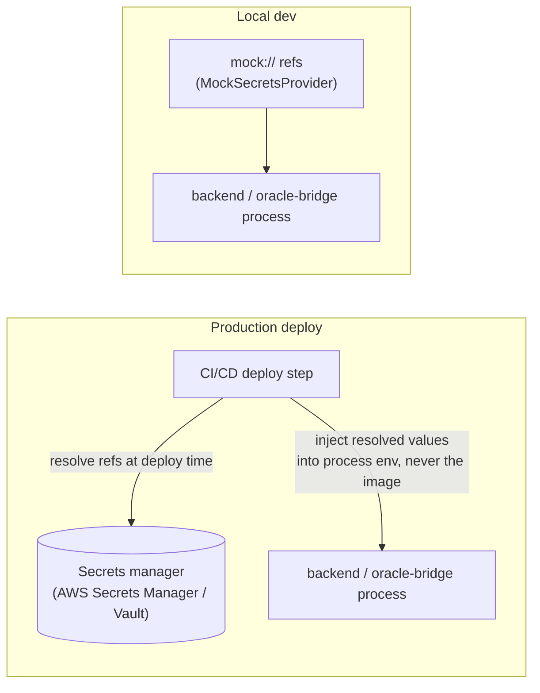

# Secrets Management & Rotation Runbook

Closes #37.

| | |
|---|---|
| **Status** | Active |
| **Scope** | Backend API (`src/`) and oracle bridge (`oracle-bridge/`) |
| **Related** | `oracle-bridge/src/secretsProvider.ts`, `src/lib/secretsProvider.ts`, `docs/ops/oracle-bridge-dr.md` |
| **CI demo** | `.github/workflows/secrets-manager-demo.yml` |

## Overview

Both services resolve secrets through a small `SecretsProvider` abstraction instead of trusting a raw value baked into an image or a long-lived static environment variable:

- **Oracle bridge** (`oracle-bridge/src/secretsProvider.ts`) already does this for the Stellar signing key: config holds `SIGNING_KEY_SECRET_REF` (a reference, e.g. a secrets-manager ARN), and the raw key is resolved in memory at runtime, never persisted to state, logs, or a backup snapshot.
- **Backend API** (`src/lib/secretsProvider.ts`) mirrors the same abstraction for use by anything that needs to resolve a secret reference (see [CI/CD integration](#cicd-integration) below).



Two providers exist on both services today:

| Provider | Purpose |
|---|---|
| `MockSecretsProvider` | Deterministic fake values for CI, local dev, and tests. Refs **must** start with `mock://` — a mock ref is refused outside a mock context so it can never be silently accepted where a real secret was expected. |
| `AwsSecretsManagerProvider` | A documented, explicit extension point. It throws a clear "not implemented" error rather than silently returning nothing — wiring it to a real secrets manager (AWS Secrets Manager, Vault, etc.) is follow-up infrastructure work tracked separately, not something to fake here. |

`SECRETS_PROVIDER=mock` (the default) or `SECRETS_PROVIDER=aws` selects which one loads, on both services.

## What's managed here vs. environment variables today

| Secret | Reference-based today? | Notes |
|---|---|---|
| Oracle bridge signing key | ✅ Yes — `SIGNING_KEY_SECRET_REF` + `SecretsProvider` | See `docs/ops/oracle-bridge-dr.md` |
| Backend `JWT_SECRET` | Rotation-aware (this doc) | Dual-key overlap window; see below |
| `AUTH_SERVER_SECRET_KEY` / `ORACLE_SERVER_SECRET_KEY` | Not yet reference-based | Runbook below covers manual rotation; wiring these through `SecretsProvider` the way the oracle bridge already does its signing key is the natural next step once an `aws`/`vault` provider is implemented |
| `DATABASE_URL` | Not yet reference-based | Runbook below covers manual rotation |

Local development and CI always use `SECRETS_PROVIDER=mock` with clearly-labeled placeholder values (see `.env.example`) — production secrets are never used outside a real deploy environment.

## JWT secret rotation (automated, dual-key)

`JWT_SECRET` signs and verifies session tokens (`src/services/auth.service.ts`). Rotating it naively — swap the value and restart — would invalidate every outstanding token instantly and log every active session out. Instead, `verifyJwt` accepts **two** secrets during a configurable overlap window:

| Env var | Purpose |
|---|---|
| `JWT_SECRET` | Current signing secret. All new tokens are issued with this one. |
| `JWT_SECRET_PREVIOUS` | Previous secret, still *accepted* (not issued) during the overlap window. |
| `JWT_SECRET_ROTATED_AT` | ISO-8601 timestamp of when the rotation started. |
| `JWT_ROTATION_OVERLAP_MS` | How long `JWT_SECRET_PREVIOUS` is accepted after `JWT_SECRET_ROTATED_AT`. Default `3600000` (1 hour). |

`verifyJwt` tries `JWT_SECRET` first; only if that fails **and** the current time is within `JWT_ROTATION_OVERLAP_MS` of `JWT_SECRET_ROTATED_AT` does it retry with `JWT_SECRET_PREVIOUS`. Once the window closes, tokens signed with the old secret stop verifying — same as if they'd expired. `JWT_SECRET_PREVIOUS` and `JWT_SECRET_ROTATED_AT` must be set together; `src/config/env.ts` fails fast at startup otherwise.

### Rotation procedure

1. Generate the new secret and see what to apply:
   ```bash
   npm run rotate:jwt-secret
   ```
   This prints a new `JWT_SECRET`, plus `JWT_SECRET_PREVIOUS` (your current secret) and `JWT_SECRET_ROTATED_AT` (now). It only prints values — it does not touch a running process or your secrets manager.
2. Write the three values to your secrets manager / deploy environment and redeploy. Existing sessions keep working (they hit the `JWT_SECRET_PREVIOUS` fallback); new sessions get the new secret immediately.
3. Once `JWT_ROTATION_OVERLAP_MS` has elapsed (default 1 hour), remove `JWT_SECRET_PREVIOUS` and `JWT_SECRET_ROTATED_AT` from the environment and redeploy again. From this point tokens signed with the retired secret are rejected.
4. To automate step 3 on a schedule, trigger it from whatever already runs your scheduled deploys/cron (e.g. a CI scheduled workflow) — this repo does not assume any particular scheduler is available.

**Emergency rotation (suspected compromise):** skip the overlap window — set the new `JWT_SECRET`, leave `JWT_SECRET_PREVIOUS`/`JWT_SECRET_ROTATED_AT` unset, and redeploy. Every existing session is invalidated immediately; all users must log in again.

## Oracle bridge signing key rotation

The oracle bridge signing key is already reference-based (`SIGNING_KEY_SECRET_REF`, resolved through `SecretsProvider`). Rotating it is a **key replacement + promotion**, not a config edit on a live process:

1. Provision a new Stellar keypair and register it on-chain via `add_oracle` (see `docs/contracts/stellarkraal-interface.md`) alongside the existing key.
2. Store the new key's raw secret in your secrets manager and update the **standby** instance's `SIGNING_KEY_SECRET_REF` to point at it.
3. Promote the standby to primary (`npm run promote` — see `docs/ops/oracle-bridge-dr.md#promotion`). Promotion is live, no restart required.
4. Once the new key has submitted successfully, deregister the old key on-chain (`remove_oracle`) and delete its secret from the secrets manager.

This reuses the existing primary/standby mechanics built for disaster recovery rather than inventing a second rotation path — see `docs/ops/oracle-bridge-dr.md` for the full primary/standby architecture and drill process.

## `AUTH_SERVER_SECRET_KEY` / `ORACLE_SERVER_SECRET_KEY` rotation

These are Stellar keypairs used for SEP-10 challenge signing and on-chain oracle submission respectively (`src/config/env.ts`). Until they're moved behind a `SecretsProvider` reference (tracked as follow-up work, same as the `aws` provider), rotation is manual:

1. Generate a new keypair: `stellar keys generate --network <network> <name>`.
2. For `ORACLE_SERVER_SECRET_KEY`: register the new public key on-chain via `add_oracle` *before* switching the env var, so submissions never fail against a key the contract doesn't recognize yet.
3. For `AUTH_SERVER_SECRET_KEY`: this key only signs SEP-10 challenges the client immediately verifies against — there's no on-chain registration step. A brief overlap isn't possible with a single env var; schedule the rotation for low-traffic hours since any in-flight challenge issued with the old key that a client tries to verify against the new key will fail, and the client simply needs to re-request a challenge.
4. Update the env var in your secrets manager / deploy environment and redeploy.
5. Deregister the old on-chain oracle key (`remove_oracle`) once the new one is confirmed working.

## Database credential rotation

`DATABASE_URL` includes inline credentials. Rotation:

1. Create a new database role/password alongside the existing one (don't reuse the old role — that reintroduces the same "swap and hope" problem JWT rotation avoids).
2. Update `DATABASE_URL` in your secrets manager / deploy environment and redeploy. Prisma's connection pool is re-established on process restart, so this is a normal restart-required rotation (unlike JWT, there's no live traffic depending on the old credential surviving past the deploy).
3. Revoke the old role/password once the new deploy is confirmed healthy.

## CI/CD integration

`.github/workflows/secrets-manager-demo.yml` demonstrates the intended deploy-time pattern end to end using `MockSecretsProvider` (no real cloud credentials involved): a deploy step resolves `mock://...` secret references at deploy time and injects the resolved values into the process environment for that step only — never into a committed file or a Docker image layer. Wiring the same workflow shape to a real secrets manager just means swapping `SECRETS_PROVIDER=mock` for `SECRETS_PROVIDER=aws` (once that provider is implemented) and pointing the refs at real ARNs/paths.

## Local development

Local dev and tests use `SECRETS_PROVIDER=mock` (the default — see `.env.example`). `.env.example`'s placeholder values are clearly non-functional (e.g. `SXXXXXXXXXXXXXXXXXXXXXXXXXXXXXXXXXXXXXXXXXXXXXXXXXXXXXXXXX`) and must never be reused in a shared or production environment. Nothing under `SECRETS_PROVIDER=mock` is ever a real credential.
