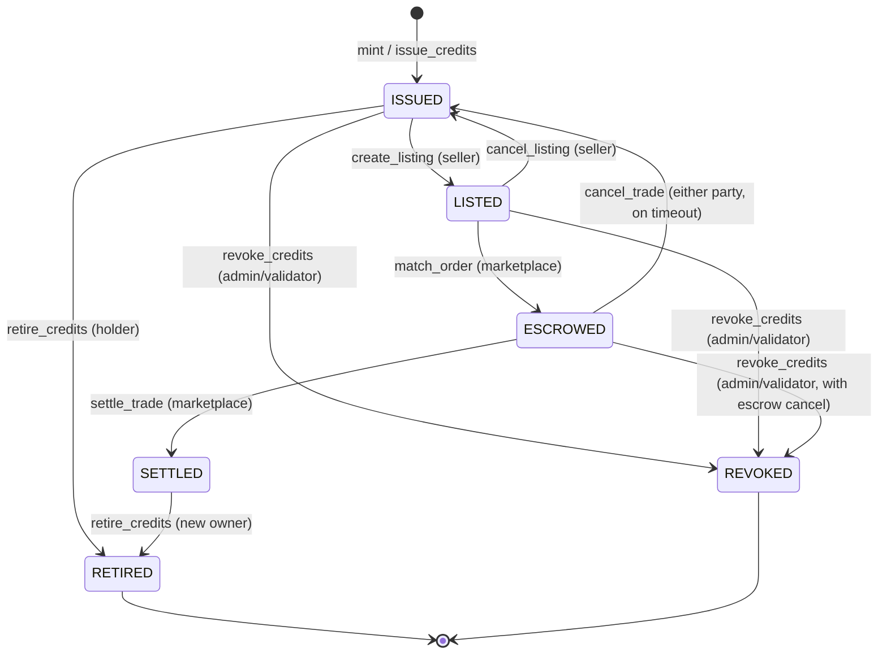
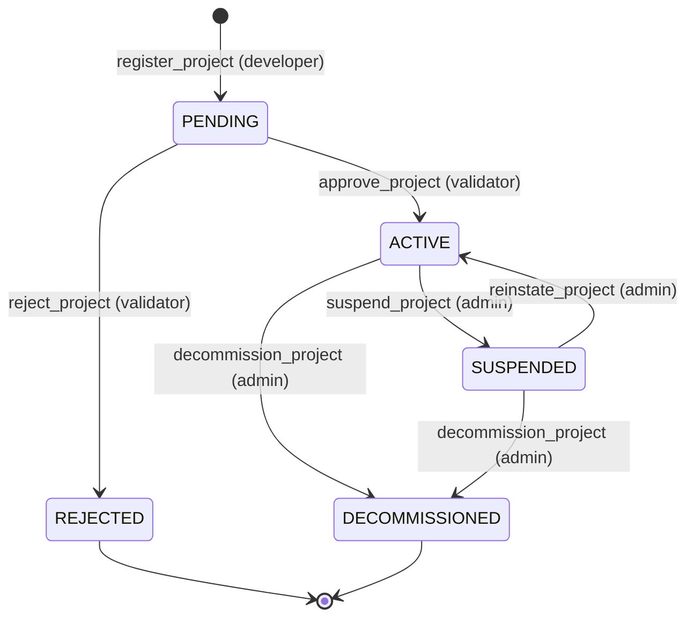

<!--
  Carbon Credit Lifecycle — Protocol Specification
  Version:  1.0.0-draft
  Status:   DRAFT
  Date:     2026-07-16
  Author:   StellarKraal Engineering
  Review requested from: [Maintainer A], [Maintainer B]
-->

# Carbon Credit Lifecycle Protocol Specification

**Version:** 1.0.0-draft | **Status:** DRAFT | **Date:** 2026-07-16 | **Author:** StellarKraal Engineering

> ⚠️ **DRAFT** — Review requested from: \[Maintainer A\], \[Maintainer B\].
> Any contradictions found between this document and the implementation must be recorded in the [Revision History](#16-revision-history).

---

## Table of Contents

1. [Introduction](#1-introduction)
2. [Out of Scope](#2-out-of-scope)
3. [Glossary](#3-glossary)
4. [Lifecycle Operation: Project Registration](#4-lifecycle-operation-project-registration)
5. [Lifecycle Operation: Credit Issuance](#5-lifecycle-operation-credit-issuance)
6. [Lifecycle Operation: Marketplace Listing](#6-lifecycle-operation-marketplace-listing)
7. [Lifecycle Operation: Order Matching](#7-lifecycle-operation-order-matching)
8. [Lifecycle Operation: Settlement](#8-lifecycle-operation-settlement)
9. [Lifecycle Operation: Credit Retirement](#9-lifecycle-operation-credit-retirement)
10. [Lifecycle Operation: Credit Revocation](#10-lifecycle-operation-credit-revocation)
11. [State Machines](#11-state-machines)
12. [Protocol Invariants](#12-protocol-invariants)
13. [Property-Based Testing Guide](#13-property-based-testing-guide)
14. [Known Limitations and Design Rationale](#14-known-limitations-and-design-rationale)
15. [Related Documents](#15-related-documents)
16. [Revision History](#16-revision-history)

---

## 1. Introduction

This document is the normative protocol specification for the **Carbon Credit Lifecycle** on the StellarKraal platform — a voluntary carbon market built on the Stellar network using Soroban smart contracts.

The specification is **implementation-independent**: an independent engineering team could reimplement the protocol from this document alone. The four Soroban contract crates listed below are the reference implementation; this document describes their intended behaviour, not their code.

### 1.1 Protocol Components

| Contract Crate | Expected File | Role |
|---|---|---|
| `carbon_registry` | `contracts/carbon_registry/src/lib.rs` | Project and credit registry — serial number assignment, lifecycle state transitions |
| `carbon_credit` | `contracts/carbon_credit/src/lib.rs` | SEP-41 token — mint, burn, transfer of credit tokens |
| `carbon_marketplace` | `contracts/carbon_marketplace/src/lib.rs` | Order book — listing, matching, escrow, settlement |
| `carbon_oracle` | `contracts/carbon_oracle/src/lib.rs` | Price feeds from Xpansiv CBL and Toucan Protocol |

### 1.2 Six Lifecycle Operations

The protocol defines six operations that, together, cover the complete lifecycle of a carbon credit:

1. **Project Registration** — A developer registers a carbon offset project; a validator approves it.
2. **Credit Issuance** — Credits are minted as SEP-41 tokens against an active project.
3. **Marketplace Listing** — A credit holder lists credits for sale at a stated price.
4. **Order Matching** — A buyer's order is matched against listed sell orders.
5. **Settlement** — The matched trade is settled atomically (credits ↔ USDC).
6. **Credit Retirement** — A holder permanently burns credits to claim the CO₂ offset.
7. **Credit Revocation** — An admin or validator invalidates fraudulent or non-compliant credits.

> Note: Revocation is the seventh operation in the document but is considered one of the six *terminal* operations alongside Retirement.

### 1.3 Normative Language

| Keyword | Meaning |
|---|---|
| **SHALL** | Mandatory requirement |
| **SHALL NOT** | Prohibition |
| **SHOULD** | Recommended but not mandatory |
| **MAY** | Optional |

---

## 2. Out of Scope

The following topics are explicitly **out of scope** for this document:

1. **REST API reference documentation** — endpoint schemas, HTTP headers, request/response bodies, and authentication flows are documented separately.
2. **Implementation code** — no pseudocode, Rust source, or algorithmic detail appears here.
3. **KYC/AML provider selection** — provider comparison and integration architecture are covered by `docs/compliance/kyc-aml-design.md`.
4. **Deployment pipeline and DevOps** — CI/CD, blue/green deployment, and infrastructure concerns are covered by `docs/issues/07-devops-docs-compliance.md`.
5. **Frontend and wallet UX** — signing flows, wallet integrations, and user-interface behaviour are out of scope.

---

## 3. Glossary

All domain-specific terms used in this document are defined below in alphabetical order.

**Additionality** — The property that a carbon reduction would not have occurred without the specific project's intervention. A credit without additionality does not represent a genuine offset.
*Used by:* `carbon_registry` project registration validation.

**AML Status** — The result of on-chain address screening by a blockchain analytics provider. Values: `NONE`, `CLEAR`, `REVIEW`, `BLOCKED`. A status of `BLOCKED` prevents all threshold-crossing operations regardless of KYC status.
*Used by:* `carbon_marketplace` KYC gate, `carbon_credit` retirement KYC gate.

**Buffer Pool** — A reserve of credits withheld from the issuer's allocation at issuance time, sized as a configured percentage of the batch. Held in a designated buffer pool address to cover future permanence failures or revocations.
*Used by:* `carbon_registry` `issue_credits` entry point.

**Carbon Credit** — A tokenised unit representing one tonne of CO₂-equivalent greenhouse gas reduced, removed, or avoided. Identified by a unique [Serial Number](#serial-number). Represented on-chain as a SEP-41 token in `carbon_credit`.

**Carbon_Credit_Contract** — The SEP-41 token contract (`contracts/carbon_credit/src/lib.rs`) that manages minting, burning, and transfer of carbon credit tokens.

**Carbon_Marketplace_Contract** — The order-book contract (`contracts/carbon_marketplace/src/lib.rs`) that handles listings, order matching, escrow, and settlement.

**Carbon_Oracle_Contract** — The price-feed contract (`contracts/carbon_oracle/src/lib.rs`) that provides validated market prices from Xpansiv CBL and Toucan Protocol data sources.

**Carbon_Registry_Contract** — The registry contract (`contracts/carbon_registry/src/lib.rs`) that manages project metadata, credit serial number assignment, and lifecycle state transitions.

**Counterparty Risk** — The risk that the other party to a matched trade will fail to deliver credits or USDC at settlement time.

**Credit Batch** — A set of carbon credits issued together from the same project vintage in a single `issue_credits` call, sharing a contiguous serial number range.

**Credit State** — The current lifecycle phase of a carbon credit. Valid states: `ISSUED`, `LISTED`, `ESCROWED`, `SETTLED`, `RETIRED`, `REVOKED`. See [§ 11](#11-state-machines).

**Escrow** — A temporary on-chain hold applied to credits (by `carbon_marketplace`) and USDC (from the buyer) during the settlement window, preventing double-spending.

**KYC Status** — The result of off-chain identity verification. Values: `NONE`, `PENDING`, `VERIFIED`, `REJECTED`, `EXPIRED`. Status must be `VERIFIED` for threshold-crossing operations.
*Used by:* `carbon_marketplace` KYC gate, `carbon_credit` retirement KYC gate.

**Ledger Sequence** — The monotonically increasing sequence number of a Stellar ledger. Used as a logical clock for expiry windows and oracle freshness checks.

**Methodology** — The audited standard under which a carbon project's reductions are quantified. Supported values: `GOLD_STANDARD`, `VERRA_VCS`, or a registered custom methodology identifier.

**Order** — A signed intent to buy or sell a specified quantity of credits at a specified price, cryptographically bound to the contract address, Stellar network passphrase, and expiry ledger sequence.

**Permanence** — The assurance that a carbon reduction will persist over time (typically 100 years for forestry projects). Projects with low permanence carry higher revocation risk.

**Project** — A registered carbon offset initiative with an on-chain identifier, methodology reference, validator address, and geographic metadata.

**Project State** — The current lifecycle phase of a project. Valid states: `PENDING`, `ACTIVE`, `SUSPENDED`, `DECOMMISSIONED`, `REJECTED`. See [§ 11](#11-state-machines).

**Protocol Spec** — This document: `docs/protocol/carbon-credit-lifecycle.md`.

**Retirement** — The permanent, irreversible burning of a carbon credit to claim the underlying CO₂ offset. A retired credit is removed from circulation and cannot be transferred, traded, or reissued.

**Revocation** — An admin- or validator-initiated action that invalidates previously issued credits due to permanence failure, fraud, or methodology non-compliance. Semantically distinct from retirement.

**Serial Number** — A globally unique identifier assigned to each carbon credit at issuance, constructed from the project ID, vintage year, and a monotonically increasing sequence number within that project-vintage scope.

**Settlement** — The atomic exchange of escrowed carbon credits (to the buyer) and escrowed USDC (to the seller), finalising a matched trade in a single Soroban transaction.

**Validator** — An accredited third-party entity whose Stellar address is registered in `carbon_registry` and who is authorised to approve or reject project registrations and, where delegated, to revoke credits.

**Vintage** — The calendar year in which the carbon reduction represented by a credit occurred. Older vintages may trade at a discount in voluntary markets.

---

## 4. Lifecycle Operation: Project Registration

### 4.1 Overview

Project Registration creates an on-chain project record in `carbon_registry`. The record begins in `PENDING` state and transitions to `ACTIVE` only after a registered validator approves it. Credits cannot be issued against a project until it is `ACTIVE`.

**Actors:**
- *Project Developer* — submits the registration request.
- *Validator* — a registered Stellar address that approves or rejects the project.
- *Carbon_Registry_Contract* — stores the project record and enforces uniqueness and state transitions.

**Entry Points:** `register_project`, `approve_project`, `reject_project`

---

### 4.2 Precondition Table

| # | Condition | Actor | Contract | Notes |
|---|---|---|---|---|
| PRE-1 | `project_id` does not already exist in the registry | Project Developer | carbon_registry | Uniqueness enforced at submission time |
| PRE-2 | `methodology_ref` is one of: `GOLD_STANDARD`, `VERRA_VCS`, or a registered custom methodology identifier | Project Developer | carbon_registry | Checked against the methodology whitelist |
| PRE-3 | `validator_address` is present in the registered validator set | Project Developer | carbon_registry | Validator must be registered before project submission |
| PRE-4 | `developer_address` is a valid Stellar G… public key (56 characters, starts with G) | Project Developer | carbon_registry | Format validation only; ownership proved by `require_auth` |
| PRE-5 | `geographic_coordinates` are provided (latitude ∈ [−90, 90], longitude ∈ [−180, 180]) | Project Developer | carbon_registry | Decimal degrees format |
| PRE-6 | Caller's signature satisfies `require_auth` for `developer_address` | Project Developer | carbon_registry | Soroban auth requirement |

---

### 4.3 Postcondition Table

| # | Effect | Contract | Notes |
|---|---|---|---|
| POST-1 | A project record exists with `project_id`, `state = PENDING`, `developer_address`, `methodology_ref`, `validator_address`, `geographic_coordinates`, and `registration_ledger_seq` | carbon_registry | Record is immutable except via authorised state transitions |
| POST-2 | `ProjectRegistered` event (schema v1) has been emitted | carbon_registry | Fields: `project_id`, `developer_addr`, `methodology_ref`, `ledger_seq`, `schemaVersion = 1` |
| POST-3 | No credits can be issued against `project_id` until state transitions to `ACTIVE` | carbon_registry | Enforced by `issue_credits` precondition check |
| POST-4 | `total_projects_count` is incremented by 1 | carbon_registry | Registry-level counter |

---

### 4.4 Flow Description

1. Project developer calls `register_project(project_id, methodology_ref, validator_address, developer_address, geographic_coordinates)`.
2. `carbon_registry` validates `require_auth` on `developer_address`.
3. `carbon_registry` checks `project_id` uniqueness — if duplicate, rejects with `DuplicateProjectId`.
4. `carbon_registry` validates `methodology_ref` against the whitelist — if invalid, rejects with `UnsupportedMethodology`.
5. `carbon_registry` validates `validator_address` is a registered validator — if not, rejects with `UnregisteredValidator`.
6. `carbon_registry` creates the project record in `PENDING` state and records the current ledger sequence.
7. `carbon_registry` emits `ProjectRegistered` (schema v1).

**Validator Approval Path:**

8. Validator calls `approve_project(project_id)`.
9. `carbon_registry` validates `require_auth` on the validator's address — if not authorised, rejects with `UnauthorizedApproval`.
10. `carbon_registry` confirms the project is in `PENDING` state — if not, rejects with `InvalidStateTransitionError`.
11. `carbon_registry` transitions project state `PENDING → ACTIVE`, records `validator_address` and `approval_ledger_seq`.
12. `carbon_registry` emits `ProjectApproved` (schema v1).

**Validator Rejection Path:**

8. Validator calls `reject_project(project_id, rejection_reason)`.
9. `carbon_registry` validates `require_auth` on the validator's address.
10. `carbon_registry` transitions project state `PENDING → REJECTED` (terminal state).
11. `carbon_registry` emits `ProjectRejected` (schema v1).

---

### 4.5 Error Catalogue

| Error Code | Typed Name | Trigger Condition | HTTP Equivalent |
|---|---|---|---|
| E-REG-001 | `DuplicateProjectId` | `project_id` already exists in the registry | 409 Conflict |
| E-REG-002 | `UnsupportedMethodology` | `methodology_ref` not in the supported methodology whitelist | 422 Unprocessable Entity |
| E-REG-003 | `UnregisteredValidator` | `validator_address` not found in the validator registry | 422 Unprocessable Entity |
| E-REG-004 | `UnauthorizedApproval` | Caller's address does not match the project's assigned validator | 403 Forbidden |
| E-REG-005 | `InvalidStateTransitionError` | Attempted transition is not in the valid set (e.g., approving an already-ACTIVE project) | 409 Conflict |

---

### 4.6 Events Emitted

| Event Name | Schema Version | Fields | Emitting Contract |
|---|---|---|---|
| `ProjectRegistered` | 1 | `project_id`, `developer_addr`, `methodology_ref`, `ledger_seq`, `schemaVersion` | carbon_registry |
| `ProjectApproved` | 1 | `project_id`, `validator_addr`, `approval_ledger_seq`, `schemaVersion` | carbon_registry |
| `ProjectRejected` | 1 | `project_id`, `validator_addr`, `rejection_reason`, `ledger_seq`, `schemaVersion` | carbon_registry |

---

## 5. Lifecycle Operation: Credit Issuance

### 5.1 Overview

Credit Issuance mints carbon credit tokens against an `ACTIVE` project. The `carbon_registry` assigns a contiguous range of serial numbers and records the batch; the `carbon_credit` SEP-41 contract mints the corresponding token quantity to the issuer's address.

**Actors:**
- *Authorized Issuer* — the project developer or a delegated issuer address.
- *Carbon_Registry_Contract* — assigns serial numbers and records the batch.
- *Carbon_Credit_Contract* — mints SEP-41 tokens.

**Entry Points:** `issue_credits` (carbon_registry), `mint` (carbon_credit)

> **Atomicity:** Both contracts are called within the same Soroban transaction. If either step fails, the entire transaction is rolled back.

---

### 5.2 Precondition Table

| # | Condition | Actor | Contract | Notes |
|---|---|---|---|---|
| PRE-1 | Project `project_id` exists and its state is `ACTIVE` | Authorized Issuer | carbon_registry | Checked at the start of `issue_credits` |
| PRE-2 | Caller satisfies `require_auth` for the authorized issuer address | Authorized Issuer | carbon_registry | Soroban auth requirement |
| PRE-3 | `quantity` is an integer in the range [1, 1,000,000,000] | Authorized Issuer | carbon_registry | Bounds validated before serial assignment |
| PRE-4 | `vintage_year` is a valid 4-digit calendar year (e.g., 2020–2099) | Authorized Issuer | carbon_registry | Year must be ≤ current year + 1 |
| PRE-5 | If a buffer pool is configured, `buffer_pool_pct` is in the range (0.00, 100.00] with up to 2 decimal places | Authorized Issuer | carbon_registry | Validated before withholding calculation |
| PRE-6 | The assigned serial range does not conflict with any existing serial range for `(project_id, vintage_year)` | carbon_registry | carbon_registry | Enforced by the serial number counter |

---

### 5.3 Postcondition Table

| # | Effect | Contract | Notes |
|---|---|---|---|
| POST-1 | A batch record exists with `batch_id`, `project_id`, `vintage_year`, `serial_start`, `serial_end`, `quantity`, `issuer_addr`, `issuance_ledger_seq`, `methodology_ref` | carbon_registry | Serial range is `[serial_start, serial_end]` inclusive; `serial_end - serial_start + 1 == quantity` |
| POST-2 | `total_supply` of `carbon_credit` token is increased by `net_quantity` (quantity minus buffer pool withholding) | carbon_credit | `net_quantity = floor(quantity × (1 − buffer_pool_pct / 100))` |
| POST-3 | Issuer's token balance in `carbon_credit` is increased by `net_quantity` | carbon_credit | Buffer pool address receives `quantity − net_quantity` |
| POST-4 | All minted tokens have an associated serial number range registered in `carbon_registry` | carbon_registry | Tokens without a registry entry are considered invalid (INV-2) |
| POST-5 | `CreditsIssued` event (schema v1) has been emitted | carbon_registry | See Events table |

---

### 5.4 Flow Description

1. Authorized issuer calls `issue_credits(project_id, vintage_year, quantity, buffer_pool_pct?)`.
2. `carbon_registry` validates `require_auth` on the issuer address.
3. `carbon_registry` checks that `project_id` exists and state is `ACTIVE` — if not, rejects with `ProjectNotActive`.
4. `carbon_registry` validates `quantity` bounds — if out of range, rejects with `InvalidQuantity`.
5. `carbon_registry` reads the current `next_serial` counter for `(project_id, vintage_year)` and assigns `serial_start = next_serial`, `serial_end = next_serial + quantity − 1`.
6. `carbon_registry` atomically increments `next_serial` by `quantity` (serialized per project-vintage to prevent race conditions).
7. If `buffer_pool_pct` is provided and > 0, `carbon_registry` calculates `buffer_qty = ceil(quantity × buffer_pool_pct / 100)` and `net_qty = quantity − buffer_qty`.
8. `carbon_registry` creates the batch record.
9. `carbon_credit` `mint` is called: `net_qty` tokens minted to issuer, `buffer_qty` tokens minted to `buffer_pool_address`.
10. `carbon_registry` emits `CreditsIssued` (schema v1).

---

### 5.5 Error Catalogue

| Error Code | Typed Name | Trigger Condition | HTTP Equivalent |
|---|---|---|---|
| E-REG-010 | `ProjectNotActive` | Target project state is not `ACTIVE` | 422 Unprocessable Entity |
| E-REG-011 | `SerialNumberConflict` | Assigned serial range overlaps with an existing range for `(project_id, vintage_year)` | 409 Conflict |
| E-REG-012 | `InvalidQuantity` | `quantity` is 0, negative, or exceeds 1,000,000,000 | 422 Unprocessable Entity |
| E-REG-013 | `InvalidBufferPoolPercentage` | `buffer_pool_pct` is ≤ 0 or > 100 or has more than 2 decimal places | 422 Unprocessable Entity |
| E-CC-001 | `UnregisteredSerialRange` | `mint` called without a corresponding registry batch record | 422 Unprocessable Entity |

---

### 5.6 Events Emitted

| Event Name | Schema Version | Fields | Emitting Contract |
|---|---|---|---|
| `CreditsIssued` | 1 | `batch_id`, `project_id`, `vintage_year`, `quantity`, `net_quantity`, `serial_start`, `serial_end`, `issuer_addr`, `buffer_pool_pct`, `issuance_ledger_seq`, `schemaVersion` | carbon_registry |

---

## 6. Lifecycle Operation: Marketplace Listing

### 6.1 Overview

A credit holder creates a sell order in `carbon_marketplace`. The listed credits are immediately escrowed (locked) from the seller's balance and transition to `LISTED` state. The sell order is valid until its `expiry_ledger` is reached.

**Actors:**
- *Credit Holder (Seller)* — submits the listing.
- *Carbon_Marketplace_Contract* — creates the order, escrows credits.
- *Carbon_Credit_Contract* — transfers credits to the marketplace escrow.
- *Carbon_Oracle_Contract* — consulted for oracle freshness check.

**Entry Points:** `create_listing` (carbon_marketplace)

---

### 6.2 Precondition Table

| # | Condition | Actor | Contract | Notes |
|---|---|---|---|---|
| PRE-1 | Seller's `carbon_credit` balance ≥ `quantity` being listed | Seller | carbon_marketplace | Checked before escrow transfer |
| PRE-2 | `current_ledger_seq < expiry_ledger` (order has a future expiry) | Seller | carbon_marketplace | `expiry_ledger` must be strictly greater than current ledger |
| PRE-3 | `carbon_oracle` last update age ≤ `max_age_ledgers` (oracle is fresh) | Seller | carbon_marketplace | `age = current_ledger − oracle_last_updated_ledger` |
| PRE-4 | `quantity` ≥ 1 and `price_per_credit_usdc` > 0 | Seller | carbon_marketplace | Bounds validation |
| PRE-5 | Order signature is valid: `H(contract_id ‖ network_passphrase ‖ expiry_ledger ‖ order_payload)` matches seller's key | Seller | carbon_marketplace | Domain-separated replay prevention (INV-8) |
| PRE-6 | If `quantity × price_per_credit_usdc ≥ KYC_TRADE_THRESHOLD_USD`: seller's `kycStatus = VERIFIED` and `amlStatus = CLEAR` | Seller | carbon_marketplace | KYC gate — default threshold: $1,000 |

---

### 6.3 Postcondition Table

| # | Effect | Contract | Notes |
|---|---|---|---|
| POST-1 | A sell order record exists with `order_id`, `seller_addr`, `project_id`, `vintage_year`, `quantity`, `price_per_credit_usdc`, `expiry_ledger`, `creation_ledger_seq`, `state = OPEN` | carbon_marketplace | Order is matchable until filled or expired |
| POST-2 | `quantity` credits have been transferred from the seller's balance to the marketplace escrow address; seller's balance is reduced by `quantity` | carbon_credit | Credit state transitions to `LISTED` in carbon_registry |
| POST-3 | `OrderCreated` event (schema v1) has been emitted | carbon_marketplace | See Events table |

---

### 6.4 Flow Description

1. Seller calls `create_listing(project_id, vintage_year, quantity, price_per_credit_usdc, expiry_ledger, signature)`.
2. `carbon_marketplace` validates `require_auth` on `seller_addr`.
3. `carbon_marketplace` queries `carbon_oracle` for `last_updated_ledger`; if `current_ledger − last_updated_ledger > max_age_ledgers`, rejects with `OracleStalenessError`.
4. `carbon_marketplace` checks `current_ledger_seq < expiry_ledger`; if not, rejects with `OrderExpiredError`.
5. `carbon_marketplace` validates the order signature against `H(contract_id ‖ network_passphrase ‖ expiry_ledger ‖ order_payload)`; if invalid, rejects with `InvalidSignatureError`.
6. `carbon_marketplace` checks the seller's `carbon_credit` balance ≥ `quantity`; if not, rejects with `InsufficientBalance`.
7. If `quantity × price_per_credit_usdc ≥ KYC_TRADE_THRESHOLD_USD`: `carbon_marketplace` checks seller's KYC/AML status; if not `VERIFIED`/`CLEAR`, rejects with `KYCVerificationError`.
8. `carbon_marketplace` transfers `quantity` credits from seller to escrow address via `carbon_credit` `transfer`.
9. `carbon_registry` updates credit state to `LISTED` for the corresponding serial range.
10. `carbon_marketplace` creates the sell order record and emits `OrderCreated` (schema v1).

**Domain-Separated Order Signing:**

Each signed order is bound to: `H(contract_id ‖ network_passphrase ‖ expiry_ledger ‖ order_payload)`. This prevents replay of testnet orders on mainnet and prevents reuse after expiry. Full design: `docs/protocol/order-signing.md` (Issue #3).

**KYC Gate:**

If the listing value (`quantity × price_per_credit_usdc`) meets or exceeds `KYC_TRADE_THRESHOLD_USD` (default: $1,000, configurable via environment variable), the seller must have `kycStatus = VERIFIED` and `amlStatus = CLEAR`. See `docs/compliance/kyc-aml-design.md` §5.

---

### 6.5 Error Catalogue

| Error Code | Typed Name | Trigger Condition | HTTP Equivalent |
|---|---|---|---|
| E-MP-001 | `OracleStalenessError` | Oracle last update age exceeds `max_age_ledgers` | 503 Service Unavailable |
| E-MP-002 | `InsufficientBalance` | Seller's credit balance < `quantity` | 422 Unprocessable Entity |
| E-MP-003 | `OrderExpiredError` | `expiry_ledger ≤ current_ledger_seq` | 422 Unprocessable Entity |
| E-MP-004 | `InvalidSignatureError` | Order signature does not verify against the domain-separated hash | 400 Bad Request |
| E-MP-005 | `KYCVerificationError` | Listing value ≥ threshold and seller's KYC/AML status is insufficient | 403 Forbidden |

---

### 6.6 Events Emitted

| Event Name | Schema Version | Fields | Emitting Contract |
|---|---|---|---|
| `OrderCreated` | 1 | `order_id`, `seller_addr`, `project_id`, `vintage_year`, `quantity`, `price_per_credit_usdc`, `expiry_ledger`, `creation_ledger_seq`, `schemaVersion` | carbon_marketplace |

---

## 7. Lifecycle Operation: Order Matching

### 7.1 Overview

A buyer submits a buy order. `carbon_marketplace` matches it against available sell orders using price-time priority. Matched credits and buyer USDC are atomically moved to escrow. The matched trade advances to the Settlement phase.

**Actors:**
- *Buyer* — submits the buy order.
- *Carbon_Marketplace_Contract* — performs matching and atomic escrow.
- *Carbon_Oracle_Contract* — consulted for price deviation check.

**Entry Points:** `match_order` (carbon_marketplace)

---

### 7.2 Precondition Table

| # | Condition | Actor | Contract | Notes |
|---|---|---|---|---|
| PRE-1 | Buy order and matched sell order specify the same `project_id` and `vintage_year` | Buyer | carbon_marketplace | Cross-vintage / cross-project matches are prohibited |
| PRE-2 | `current_ledger_seq < sell_order.expiry_ledger` (sell order has not expired) | Buyer | carbon_marketplace | Expired orders are not matchable |
| PRE-3 | Oracle is fresh: `current_ledger − oracle_last_updated_ledger ≤ max_age_ledgers` | Buyer | carbon_marketplace | INV-7 |
| PRE-4 | `matched_price` does not deviate from oracle reference price by more than `max_deviation_pct` (0.01–100.00%) | Buyer | carbon_marketplace | INV-7 price integrity check |
| PRE-5 | `buyer_addr ≠ seller_addr` (no wash-trading) | Buyer | carbon_marketplace | INV-3 |
| PRE-6 | Buyer's USDC balance ≥ `quantity × matched_price` | Buyer | carbon_marketplace | Checked before USDC escrow |
| PRE-7 | If `quantity × matched_price ≥ KYC_TRADE_THRESHOLD_USD`: buyer's `kycStatus = VERIFIED` and `amlStatus = CLEAR` | Buyer | carbon_marketplace | KYC gate |

---

### 7.3 Postcondition Table

| # | Effect | Contract | Notes |
|---|---|---|---|
| POST-1 | `quantity` credits transition from `LISTED` to `ESCROWED` state in `carbon_registry` | carbon_registry | Credits locked in marketplace escrow |
| POST-2 | Buyer's USDC balance is reduced by `quantity × matched_price`; USDC is held in marketplace escrow | carbon_marketplace | Atomic with credit escrow — both succeed or both roll back |
| POST-3 | A match record exists with `match_id`, `buy_order_id`, `sell_order_id`, `quantity`, `matched_price`, `buyer_addr`, `seller_addr`, `match_ledger_seq`, `state = ESCROWED` | carbon_marketplace | Match record drives settlement |
| POST-4 | `OrderMatched` event (schema v1) has been emitted | carbon_marketplace | See Events table |

---

### 7.4 Flow Description

1. Buyer calls `match_order(buy_order_id, sell_order_id, quantity, max_price)`.
2. `carbon_marketplace` validates `require_auth` on `buyer_addr`.
3. `carbon_marketplace` checks `buyer_addr ≠ seller_addr`; if equal, rejects with `WashTradingError`.
4. `carbon_marketplace` validates `project_id` and `vintage_year` match between orders; if not, rejects with `IncompatibleOrderError`.
5. `carbon_marketplace` checks `sell_order.expiry_ledger > current_ledger_seq`; if not, rejects with `OrderExpiredError`.
6. `carbon_marketplace` queries `carbon_oracle` for the reference price; if deviation > `max_deviation_pct`, rejects with `PriceDeviationExceededError`.
7. If `quantity × matched_price ≥ KYC_TRADE_THRESHOLD_USD`: `carbon_marketplace` checks buyer's KYC/AML status; if not `VERIFIED`/`CLEAR`, rejects with `KYCVerificationError`.
8. `carbon_marketplace` checks buyer's USDC balance ≥ `quantity × matched_price`; if not, rejects with `InsufficientUSDCBalance`.
9. **Atomic escrow:** `carbon_marketplace` atomically (a) transfers credits from marketplace listing escrow to trade escrow, and (b) transfers USDC from buyer to trade escrow. If either fails, both are rolled back.
10. `carbon_registry` updates credit state to `ESCROWED` for the matched serial range.
11. `carbon_marketplace` creates the match record and emits `OrderMatched` (schema v1).

**Price-Time Priority Algorithm:**

When multiple sell orders are available, `carbon_marketplace` SHALL select orders by:
1. Lowest `price_per_credit_usdc` first (best price for buyer).
2. Among equal prices, earliest `creation_ledger_seq` first (time priority).

**Partial Fill and No-Match Behaviour:**

- If the matched sell order quantity > `quantity` requested, the sell order is partially filled; the remainder stays `LISTED`.
- If no sell order is available at or below `max_price` for the given `project_id` / `vintage_year`, `match_order` returns a no-match result without error and without any state change.

---

### 7.5 Error Catalogue

| Error Code | Typed Name | Trigger Condition | HTTP Equivalent |
|---|---|---|---|
| E-MP-010 | `IncompatibleOrderError` | `project_id` or `vintage_year` differ between buy and sell orders | 422 Unprocessable Entity |
| E-MP-011 | `PriceDeviationExceededError` | `matched_price` deviates from oracle reference by more than `max_deviation_pct` | 422 Unprocessable Entity |
| E-MP-012 | `WashTradingError` | `buyer_addr == seller_addr` | 403 Forbidden |
| E-MP-013 | `KYCVerificationError` | Trade value ≥ threshold and buyer's KYC/AML status is insufficient | 403 Forbidden |
| E-MP-003 | `OrderExpiredError` | Sell order `expiry_ledger ≤ current_ledger_seq` | 422 Unprocessable Entity |
| E-MP-014 | `InsufficientUSDCBalance` | Buyer's USDC balance < `quantity × matched_price` | 422 Unprocessable Entity |

---

### 7.6 Events Emitted

| Event Name | Schema Version | Fields | Emitting Contract |
|---|---|---|---|
| `OrderMatched` | 1 | `match_id`, `buy_order_id`, `sell_order_id`, `quantity`, `matched_price`, `buyer_addr`, `seller_addr`, `match_ledger_seq`, `schemaVersion` | carbon_marketplace |

---

## 8. Lifecycle Operation: Settlement

### 8.1 Overview

Settlement finalises a matched trade by atomically transferring escrowed credits to the buyer and escrowed USDC to the seller in a single Soroban transaction. On failure, the `ESCROWED` state is preserved so that the trade can be retried or cancelled.

**Actors:**
- *Carbon_Marketplace_Contract* — executes settlement automatically after matching; either party can trigger cancellation on timeout.
- *Carbon_Registry_Contract* — ownership record is updated.
- *Buyer / Seller* — either party may trigger `cancel_trade` after the settlement window expires.

**Entry Points:** `settle_trade`, `cancel_trade` (carbon_marketplace)

---

### 8.2 Precondition Table

| # | Condition | Actor | Contract | Notes |
|---|---|---|---|---|
| PRE-1 | Match record state is `ESCROWED` | carbon_marketplace | carbon_marketplace | Only `ESCROWED` trades can be settled |
| PRE-2 | Settlement window has not expired: `current_ledger_seq ≤ match_ledger_seq + settlement_window_ledgers` | carbon_marketplace | carbon_marketplace | Default window: 1,000 ledgers; configurable 100–10,000 |
| PRE-3 | No reentrancy lock is active for this trade | carbon_marketplace | carbon_marketplace | INV-3 reentrancy guard |
| PRE-4 | Escrowed credit quantity matches `match.quantity` | carbon_marketplace | carbon_marketplace | Integrity check before transfer |
| PRE-5 | Escrowed USDC amount matches `match.quantity × match.matched_price` | carbon_marketplace | carbon_marketplace | Exact match — no tolerance |

---

### 8.3 Postcondition Table

| # | Effect | Contract | Notes |
|---|---|---|---|
| POST-1 | `match.quantity` credits are transferred from trade escrow to `buyer_addr`; buyer's `carbon_credit` balance increases by `quantity` | carbon_credit | Credit state transitions to `SETTLED` |
| POST-2 | `match.quantity × match.matched_price` USDC is transferred from trade escrow to `seller_addr`; seller's USDC balance increases accordingly | carbon_marketplace | USDC transfer executed atomically with credit transfer |
| POST-3 | Credit ownership record for the settled serial range is updated to `buyer_addr` in `carbon_registry` | carbon_registry | Ownership transfer recorded on-chain |
| POST-4 | Match record state transitions to `SETTLED` | carbon_marketplace | Terminal state for a completed trade |
| POST-5 | `TradeSettled` event (schema v1) has been emitted | carbon_marketplace | See Events table |
| POST-6 | Settlement is recorded in the on-chain audit log: `trade_id`, `buyer_addr`, `seller_addr`, `quantity`, `matched_price`, `settlement_ledger_seq` | carbon_marketplace | Permanent audit record |

---

### 8.4 Flow Description

**Happy Path:**

1. `carbon_marketplace` calls `settle_trade(match_id)`.
2. Validates match state is `ESCROWED` — if not, rejects with `InvalidTradeStateError`.
3. Validates settlement window has not expired — if expired, rejects with `SettlementWindowExpiredError`.
4. Acquires reentrancy lock for `match_id`.
5. **State transitions are committed first** (match state → `SETTLED`, registry ownership updated).
6. Transfers escrowed credits to `buyer_addr` via `carbon_credit` `transfer`.
7. Transfers escrowed USDC to `seller_addr`.
8. Releases reentrancy lock.
9. Writes audit log entry.
10. Emits `TradeSettled` (schema v1).

**Failure Path:**

- If any step from 5 onward fails, the Soroban transaction is rolled back atomically.
- Match state remains `ESCROWED`; escrowed assets remain locked.
- Either party may retry `settle_trade`, or wait for the settlement window to expire and then call `cancel_trade`.

**Cancellation Path (settlement window expired):**

1. Either party calls `cancel_trade(match_id)`.
2. `carbon_marketplace` validates `current_ledger_seq > match_ledger_seq + settlement_window_ledgers`.
3. Releases escrowed credits back to `seller_addr`; credit state returns to `ISSUED`.
4. Releases escrowed USDC back to `buyer_addr`.
5. Match state transitions to `CANCELLED`.
6. Emits `TradeCancelled` (schema v1).

**Reentrancy Prevention:**

All state transitions (step 5) are committed **before** any external token transfer calls are initiated (steps 6–7). A re-entrant call arriving while the lock is held SHALL be rejected with `ReentrancyError`. This conforms to Soroban's host environment model described in `docs/issues/01-smart-contract-security.md` Issue #2.

---

### 8.5 Error Catalogue

| Error Code | Typed Name | Trigger Condition | HTTP Equivalent |
|---|---|---|---|
| E-MP-020 | `InvalidTradeStateError` | Match record state is not `ESCROWED` | 409 Conflict |
| E-MP-021 | `SettlementWindowExpiredError` | Settlement window has expired (for `settle_trade`) or has not yet expired (for `cancel_trade`) | 409 Conflict |
| E-MP-022 | `SettlementValueMismatchError` | Escrowed credit quantity or USDC amount does not match the match record | 500 Internal Server Error |
| E-MP-023 | `ReentrancyError` | Re-entrant call detected while settlement lock is held | 409 Conflict |

---

### 8.6 Events Emitted

| Event Name | Schema Version | Fields | Emitting Contract |
|---|---|---|---|
| `TradeSettled` | 1 | `match_id`, `buyer_addr`, `seller_addr`, `quantity`, `matched_price`, `settlement_ledger_seq`, `schemaVersion` | carbon_marketplace |
| `TradeCancelled` | 1 | `match_id`, `cancelling_party_addr`, `cancellation_ledger_seq`, `reason`, `schemaVersion` | carbon_marketplace |

---

## 9. Lifecycle Operation: Credit Retirement

### 9.1 Overview

Retirement is the permanent, irreversible burning of carbon credits to claim the underlying CO₂ offset. The `carbon_credit` contract burns the tokens; `carbon_registry` marks the serial numbers as `RETIRED` and persists a permanent retirement record on-chain.

**Actors:**
- *Credit Holder (Retiring Party)* — initiates retirement.
- *Carbon_Credit_Contract* — burns the tokens.
- *Carbon_Registry_Contract* — marks serials `RETIRED`, persists retirement record.

**Entry Points:** `retire_credits` (carbon_credit + carbon_registry, called atomically)

---

### 9.2 Precondition Table

| # | Condition | Actor | Contract | Notes |
|---|---|---|---|---|
| PRE-1 | Caller satisfies `require_auth` for the credit holder's address | Credit Holder | carbon_credit | Soroban auth |
| PRE-2 | Credit holder's `carbon_credit` balance ≥ `quantity` | Credit Holder | carbon_credit | Checked before burn |
| PRE-3 | The credits to be retired are not in state `RETIRED` or `REVOKED` | Credit Holder | carbon_registry | Duplicate retirement is prohibited |
| PRE-4 | `quantity` ≥ 1 | Credit Holder | carbon_credit | Minimum retirement quantity |
| PRE-5 | `beneficiary_name` length ∈ [1, 256] characters | Credit Holder | carbon_registry | Retirement record field |
| PRE-6 | `retirement_purpose` length ∈ [1, 1,024] characters | Credit Holder | carbon_registry | Retirement record field |
| PRE-7 | If `quantity × oracle_reference_price ≥ KYC_RETIREMENT_THRESHOLD_USD`: holder's `kycStatus = VERIFIED` and `amlStatus = CLEAR` | Credit Holder | carbon_credit | KYC gate — default threshold: $3,000 |

---

### 9.3 Postcondition Table

| # | Effect | Contract | Notes |
|---|---|---|---|
| POST-1 | `carbon_credit` total supply is reduced by `quantity`; holder's balance is reduced by `quantity` | carbon_credit | INV-1: `supply_after = supply_before − quantity` |
| POST-2 | The retired serial numbers are marked `RETIRED` in `carbon_registry`; state is terminal — no further transitions are permitted | carbon_registry | INV-5: retirement irreversibility |
| POST-3 | A permanent on-chain retirement record exists for each retired serial number: `retiring_addr`, `beneficiary_name`, `retirement_purpose`, `retirement_ledger_seq` | carbon_registry | Record is publicly queryable |
| POST-4 | `CreditsRetired` event (schema v1) has been emitted | carbon_registry | See Events table |

---

### 9.4 Flow Description

1. Credit holder calls `retire_credits(serial_start, serial_end, beneficiary_name, retirement_purpose)`.
2. `carbon_credit` validates `require_auth` on the holder's address — if not authorised, rejects with `UnauthorizedRetirementError`.
3. `carbon_credit` calculates `quantity = serial_end − serial_start + 1` and checks holder's balance ≥ `quantity` — if not, rejects with `InsufficientBalanceError`.
4. `carbon_registry` checks the target serial range is not `RETIRED` or `REVOKED` — if already retired, rejects with `CreditAlreadyRetiredError`.
5. If `quantity × oracle_reference_price ≥ KYC_RETIREMENT_THRESHOLD_USD`: checks `kycStatus = VERIFIED` and `amlStatus = CLEAR` — if not, rejects with `KYCRetirementRequiredError`.
6. **Atomically (within one Soroban transaction):**
   a. `carbon_credit` burns `quantity` tokens from the holder's balance.
   b. `carbon_registry` marks all serial numbers in `[serial_start, serial_end]` as `RETIRED`.
   c. `carbon_registry` writes the permanent retirement record.
7. `carbon_registry` emits `CreditsRetired` (schema v1).

**Atomicity guarantee:** If step 6b or 6c fails after 6a, the entire Soroban transaction is rolled back — no tokens are burned unless the registry update also succeeds.

---

### 9.5 Error Catalogue

| Error Code | Typed Name | Trigger Condition | HTTP Equivalent |
|---|---|---|---|
| E-CC-010 | `UnauthorizedRetirementError` | Caller is not the credit holder or `require_auth` fails | 403 Forbidden |
| E-CC-011 | `InsufficientBalanceError` | Holder's balance < `quantity` | 422 Unprocessable Entity |
| E-REG-020 | `CreditAlreadyRetiredError` | Target serial numbers are already in `RETIRED` state | 409 Conflict |
| E-CC-012 | `KYCRetirementRequiredError` | Retirement value ≥ threshold and holder's KYC/AML status is insufficient | 403 Forbidden |

---

### 9.6 Events Emitted

| Event Name | Schema Version | Fields | Emitting Contract |
|---|---|---|---|
| `CreditsRetired` | 1 | `batch_id`, `serial_start`, `serial_end`, `quantity`, `retiring_addr`, `beneficiary_name`, `retirement_purpose`, `retirement_ledger_seq`, `schemaVersion` | carbon_registry |

---

## 10. Lifecycle Operation: Credit Revocation

### 10.1 Overview

Revocation invalidates previously issued credits due to permanence failure, fraud, methodology non-compliance, validator withdrawal, or a regulatory order. It is an admin-gated operation. Unlike retirement, revocation is externally imposed rather than voluntarily initiated by the holder.

**Actors:**
- *Registry Admin* — the admin address stored in `carbon_registry`.
- *Delegated Validator* — a validator address that has been granted `REVOCATION_AUTHORITY` by the admin.
- *Carbon_Registry_Contract* — marks serials `REVOKED`, enforces authority.
- *Carbon_Credit_Contract* — burns the tokens.
- *Carbon_Marketplace_Contract* — cancels any in-flight escrow before burn.

**Entry Points:** `revoke_credits` (carbon_registry)

---

### 10.2 Precondition Table

| # | Condition | Actor | Contract | Notes |
|---|---|---|---|---|
| PRE-1 | Caller is the registry `admin_address` or a validator address holding `REVOCATION_AUTHORITY` | Admin / Validator | carbon_registry | `require_auth` on the caller's address |
| PRE-2 | Target serial numbers are not already in `RETIRED` or `REVOKED` state | Admin / Validator | carbon_registry | Cannot revoke already-terminal credits |
| PRE-3 | `revocation_reason` is a valid enumeration value | Admin / Validator | carbon_registry | Must be one of the five defined reason codes |
| PRE-4 | `quantity` ≥ 1 and does not exceed the remaining non-terminal credits for the batch | Admin / Validator | carbon_registry | INV-9 conservation check |

---

### 10.3 Postcondition Table

| # | Effect | Contract | Notes |
|---|---|---|---|
| POST-1 | Target serial numbers are marked `REVOKED` in `carbon_registry`; state is terminal | carbon_registry | INV-3, INV-6 |
| POST-2 | `quantity` tokens are burned from the current holder's balance in `carbon_credit` | carbon_credit | INV-1: supply reduced by `quantity` |
| POST-3 | INV-9 holds: `revoked_qty + retired_qty ≤ issued_qty` for `(project_id, vintage_year)` | carbon_registry | Checked post-revocation |
| POST-4 | If revoked credits were in `ESCROWED` state: the associated trade is cancelled and buyer's USDC is returned before the burn | carbon_marketplace | ESCROWED interception path |
| POST-5 | `CreditsRevoked` event (schema v1) has been emitted | carbon_registry | See Events table |

---

### 10.4 Flow Description

1. Admin or delegated validator calls `revoke_credits(serial_start, serial_end, revocation_reason)`.
2. `carbon_registry` validates `require_auth` — if caller is neither admin nor a validator with `REVOCATION_AUTHORITY`, rejects with `UnauthorizedRevocationError`.
3. `carbon_registry` validates `revocation_reason` against the five allowed values — if unknown, rejects with `InvalidRevocationReasonError`.
4. `carbon_registry` checks target serial numbers are not `RETIRED` or `REVOKED` — if any are terminal, rejects with `InvalidRevocationTargetError`.

**ESCROWED Interception Path (if target credits are in `ESCROWED` state):**

5a. `carbon_marketplace` is called to cancel the associated trade.
5b. Buyer's escrowed USDC is returned to `buyer_addr`.
5c. Credit state is released from `ESCROWED` before the burn proceeds.

**Burn and Mark:**

6. **Atomically:**
   a. `carbon_credit` burns `quantity` tokens from the current holder's address.
   b. `carbon_registry` marks all serial numbers in `[serial_start, serial_end]` as `REVOKED`.
   c. `carbon_registry` increments `revoked_qty` for `(project_id, vintage_year)` and verifies INV-9.
7. `carbon_registry` writes the permanent revocation audit record.
8. `carbon_registry` emits `CreditsRevoked` (schema v1).

**Valid Revocation Reason Codes:**

| Code | Meaning |
|---|---|
| `PERMANENCE_FAILURE` | The carbon reduction did not persist as required by the methodology |
| `FRAUD` | The project or issuance was found to be fraudulent |
| `METHODOLOGY_NON_COMPLIANCE` | The project violated the methodology's monitoring or verification requirements |
| `VALIDATOR_WITHDRAWAL` | The accrediting validator has withdrawn its endorsement of the project |
| `REGULATORY_ORDER` | A government or regulatory body has ordered the revocation |

---

### 10.5 Error Catalogue

| Error Code | Typed Name | Trigger Condition | HTTP Equivalent |
|---|---|---|---|
| E-REG-030 | `UnauthorizedRevocationError` | Caller lacks admin or `REVOCATION_AUTHORITY` | 403 Forbidden |
| E-REG-031 | `InvalidRevocationTargetError` | Target serials are already in `RETIRED` or `REVOKED` state | 409 Conflict |
| E-REG-032 | `InvalidRevocationReasonError` | `revocation_reason` is not one of the five defined codes | 422 Unprocessable Entity |

---

### 10.6 Events Emitted

| Event Name | Schema Version | Fields | Emitting Contract |
|---|---|---|---|
| `CreditsRevoked` | 1 | `batch_id`, `serial_start`, `serial_end`, `quantity`, `revoking_authority_addr`, `revocation_reason`, `ledger_seq`, `schemaVersion` | carbon_registry |

---

## 11. State Machines

### 11.1 Credit State Machine

The following diagram shows all valid states and transitions for a carbon credit. Any transition not shown is **invalid** and SHALL be rejected by the respective contract with `InvalidStateTransitionError`.

**Credit State Transition Table:**

| From | To | Trigger | Actor |
|---|---|---|---|
| *(new)* | `ISSUED` | `issue_credits` / `mint` | Authorized Issuer |
| `ISSUED` | `LISTED` | `create_listing` | Credit Holder |
| `LISTED` | `ESCROWED` | `match_order` | Marketplace (automated) |
| `LISTED` | `ISSUED` | `cancel_listing` | Seller |
| `ESCROWED` | `SETTLED` | `settle_trade` | Marketplace (automated) |
| `ESCROWED` | `ISSUED` | `cancel_trade` (timeout) | Either party |
| `ISSUED` | `RETIRED` | `retire_credits` | Credit Holder |
| `SETTLED` | `RETIRED` | `retire_credits` | New Owner |
| `ISSUED` | `REVOKED` | `revoke_credits` | Admin / Validator |
| `LISTED` | `REVOKED` | `revoke_credits` | Admin / Validator |
| `ESCROWED` | `REVOKED` | `revoke_credits` (+ escrow cancel) | Admin / Validator |

> `RETIRED` and `REVOKED` are **terminal states**. No further transitions are permitted.

---

### 11.2 Project State Machine

The following diagram shows all valid states and transitions for a project record.

**Project State Transition Table:**

| From | To | Trigger | Actor |
|---|---|---|---|
| *(new)* | `PENDING` | `register_project` | Project Developer |
| `PENDING` | `ACTIVE` | `approve_project` | Registered Validator |
| `PENDING` | `REJECTED` | `reject_project` | Registered Validator |
| `ACTIVE` | `SUSPENDED` | `suspend_project` | Admin |
| `SUSPENDED` | `ACTIVE` | `reinstate_project` | Admin |
| `ACTIVE` | `DECOMMISSIONED` | `decommission_project` | Admin |
| `SUSPENDED` | `DECOMMISSIONED` | `decommission_project` | Admin |

> `REJECTED` and `DECOMMISSIONED` are **terminal states**. Credits cannot be issued against a `SUSPENDED` or `DECOMMISSIONED` project.

---

## 12. Protocol Invariants

The following invariants hold at all times. Each invariant is cross-referenced to the contract entry point that enforces it. Because the four contract crates are not yet present in the repository, file:line ranges are marked as pending.

| # | Invariant Name | Formal Statement | Contract | Entry Point(s) | File : Lines |
|---|---|---|---|---|---|
| INV-1 | **Supply Conservation** | `total_supply_after_mint = total_supply_before + quantity` and `total_supply_after_burn = total_supply_before − quantity` | carbon_credit | `mint`, `burn` | `contracts/carbon_credit/src/lib.rs` — *file not yet present; entry points expected: `mint`, `burn`* |
| INV-2 | **Serial Number Uniqueness** | For all credits: the tuple `(project_id, vintage_year, serial_number)` is globally unique across all batch records | carbon_registry | `issue_credits` | `contracts/carbon_registry/src/lib.rs` — *file not yet present; entry point expected: `issue_credits`* |
| INV-3 | **State Machine Legality** | Only transitions listed in [§ 11](#11-state-machines) are ever applied; all others are rejected with `InvalidStateTransitionError` | carbon_registry, carbon_marketplace | All state-mutating entry points | Both contract files — *not yet present* |
| INV-4 | **Escrow Balance Conservation** | `Σ(escrowed_credits) + Σ(circulating_credits) = total_supply` at all times | carbon_marketplace | `create_listing`, `match_order`, `settle_trade`, `cancel_trade`, `cancel_listing` | `contracts/carbon_marketplace/src/lib.rs` — *file not yet present* |
| INV-5 | **Retirement Irreversibility** | For any credit in `RETIRED` state: no state transition `RETIRED → X` is ever applied for any `X` | carbon_registry | `retire_credits`, all state-mutating entry points | `contracts/carbon_registry/src/lib.rs` — *file not yet present* |
| INV-6 | **Revocation Authority** | `revoke_credits` is only executed when the caller is `admin_address` or a validator address with `REVOCATION_AUTHORITY` flag set | carbon_registry | `revoke_credits` | `contracts/carbon_registry/src/lib.rs` — *file not yet present; entry point expected: `revoke_credits`* |
| INV-7 | **Oracle Staleness Enforcement** | At every call to `create_listing` and `match_order`: `current_ledger − oracle_last_updated_ledger ≤ max_age_ledgers` | carbon_marketplace | `create_listing`, `match_order` | `contracts/carbon_marketplace/src/lib.rs` — *file not yet present* |
| INV-8 | **Order Replay Prevention** | The hash `H(contract_id ‖ network_passphrase ‖ expiry_ledger ‖ order_payload)` is unique per accepted order; a previously used hash is rejected | carbon_marketplace | `create_listing`, `match_order` | `contracts/carbon_marketplace/src/lib.rs` — *file not yet present* |
| INV-9 | **Issuance-Retirement-Revocation Conservation** | For every `(project_id, vintage_year)`: `revoked_qty + retired_qty ≤ issued_qty` at all times | carbon_registry | `retire_credits`, `revoke_credits` | `contracts/carbon_registry/src/lib.rs` — *file not yet present* |

> **Note for maintainers:** When the contract source files are created, update the File:Lines column with the precise line ranges for each entry point. Record the update in the [Revision History](#16-revision-history).

---

## 13. Property-Based Testing Guide

This section identifies one property-based testing (PBT) opportunity per lifecycle operation. The invariant under test, input domain, and property type are stated for each. The fuzz testing harness for `carbon_credit` is tracked in Issue #1 (`docs/issues/01-smart-contract-security.md`); fuzz corpus will live at `contracts/carbon_credit/fuzz/`.

| Operation | Invariant Under Test | Input Domain | Property Type |
|---|---|---|---|
| Project Registration | Duplicate ID rejection | Generate random `project_id` strings (length 8–64, alphanumeric); submit the same ID twice | Error-condition |
| Credit Issuance | Supply conservation (INV-1) | Generate random `quantity` values ∈ [1, 1,000,000,000]; issue N batches; sum quantities | Round-trip: `final_supply = initial_supply + Σ(quantities)` |
| Marketplace Listing | Oracle staleness gate (INV-7) | Generate `oracle_last_updated_ledger` values spanning [current − max_age − 1000, current + 100]; vary `max_age_ledgers` | Metamorphic: listing accepted iff `age ≤ max_age_ledgers`; rejected otherwise |
| Order Matching | Wash-trading prevention (INV-3) | Generate buy and sell orders; vary `buyer_addr == seller_addr` vs `buyer_addr ≠ seller_addr` | Error-condition: same-address match always rejected with `WashTradingError` |
| Settlement | Atomic DVP conservation (INV-4) | Generate matched trades; inject random failure modes (error on credit transfer, error on USDC transfer); check escrow balances after failure | Round-trip: on failure, `escrowed_credits + escrowed_usdc = pre-match values`; no assets disappear |
| Credit Retirement | Retirement irreversibility (INV-5) | Retire a set of serial numbers; then attempt all state-mutating operations (`create_listing`, `retire_credits`, `revoke_credits`) on the same serials | Error-condition: every post-retirement operation is rejected |
| Credit Revocation | Conservation invariant (INV-9) | Generate arbitrary sequences of `issue_credits`, `retire_credits`, `revoke_credits` calls for the same `(project_id, vintage_year)`; check after each call | Metamorphic: `revoked_qty + retired_qty ≤ issued_qty` always holds |

### 13.1 Project Registration — PBT Detail

Generate random 8–64 character alphanumeric project IDs using a property test framework (e.g., `proptest` in Rust). For each generated ID, submit `register_project` twice. Assert that the second call always returns `DuplicateProjectId`. Also assert that the first call always succeeds when all other preconditions are met, forming a round-trip property: register → check state == PENDING.

### 13.2 Credit Issuance — PBT Detail

Generate lists of random `quantity` values, each in [1, 1,000,000,000]. Call `issue_credits` for each. After all calls, query `carbon_credit` total supply. Assert `total_supply_final = total_supply_initial + sum(quantities)`. This exercises INV-1 across arbitrary batch sizes.

### 13.3 Marketplace Listing — PBT Detail

Parameterise `max_age_ledgers` and `oracle_last_updated_ledger`. Generate pairs `(current_ledger, last_updated)` from a domain spanning both sides of the freshness boundary. Call `create_listing` with each pair. Assert: listing succeeds iff `current_ledger − last_updated ≤ max_age_ledgers`; otherwise returns `OracleStalenessError`. This is a metamorphic property — doubling `max_age_ledgers` doubles the acceptance region.

### 13.4 Order Matching — PBT Detail

Generate order pairs with varying `buyer_addr` and `seller_addr`. In cases where they match, call `match_order` and assert `WashTradingError` is returned. In cases where they differ, assert the match proceeds. This directly targets INV-3's wash-trading guard.

### 13.5 Settlement — PBT Detail

After a successful `match_order`, inject failures at each step of `settle_trade` using a mock credit or USDC contract that returns an error at a specified step. After each injected failure, query escrow balances and assert that `escrowed_credits + escrowed_usdc` equals the pre-match values. No assets should be created or destroyed on partial failure.

### 13.6 Credit Retirement — PBT Detail

Retire a batch of serial numbers. Then generate all possible state-mutating calls (`create_listing`, `retire_credits`, `revoke_credits`, `transfer`) using the same serial range. Assert every call returns the appropriate "already terminal" error. This tests INV-5 exhaustively.

### 13.7 Credit Revocation — PBT Detail

Generate random sequences of: `issue_credits(qty_i)`, `retire_credits(qty_r)`, `revoke_credits(qty_v)` for a fixed `(project_id, vintage_year)`. After each operation, assert `revoked_total + retired_total ≤ issued_total`. If a revocation or retirement would violate INV-9, assert it is rejected. This is a stateful property test.

---

## 14. Known Limitations and Design Rationale

### 14.1 Single-Admin-Key Centralization Risk

**Decision:** The revocation entry point (`revoke_credits`) is gated on a single `admin_address` stored in `carbon_registry`, plus validator addresses that have been explicitly delegated `REVOCATION_AUTHORITY`.

**Trade-off accepted:** This centralisation simplifies the initial implementation and reduces on-chain governance overhead. However, a compromised admin key can revoke any credit in the system — a significant trust assumption.

**Known risk:** Admin key compromise would allow fraudulent bulk revocations, destroying legitimate credit holdings without recourse.

**Deferred mitigations:**
- Multi-sig admin via Stellar's native multi-signature support (tracked in Issue #4, `docs/issues/01-smart-contract-security.md`).
- Time-locked revocations with a challenge window.
- On-chain governance voting for revocations above a quantity threshold.

### 14.2 Oracle Staleness Window Trade-off

**Decision:** `max_age_ledgers` is a configurable parameter (no hardcoded default in the contract). The deployment default is chosen to tolerate one missed oracle update cycle.

**Trade-off accepted:** A tight window reduces price manipulation risk but increases the probability of legitimate listings failing during oracle bridge outages or maintenance windows.

**Known risk:** If the oracle bridge is down for longer than `max_age_ledgers`, all new listings and matches are blocked until the bridge recovers. This is a liveness risk.

**Deferred mitigations:** Oracle liveness guarantee (dead-man's-switch watchdog) is addressed in Issue #12 (`docs/issues/03-oracle-data-integrity.md`). Multi-oracle median aggregation is in Issue #15.

### 14.3 Replay Attack Prevention

**Decision:** Each signed order is domain-separated using `H(contract_id ‖ network_passphrase ‖ expiry_ledger ‖ order_payload)`, analogous to EIP-712 but adapted for Soroban's XDR-native auth model.

**Rationale:** Including the Stellar network passphrase prevents testnet orders from being replayed on mainnet. Including `expiry_ledger` prevents replay after the order has expired. Including `contract_id` prevents replay across contract upgrades.

**Known limitation:** The order-signing scheme depends on the client correctly serialising the payload before hashing. Inconsistent serialisation between client implementations will produce signature failures.

**Full design:** `docs/protocol/order-signing.md` (Issue #3, `docs/issues/01-smart-contract-security.md`).

### 14.4 KYC/AML Threshold Configuration

**Decision:** KYC/AML thresholds (`KYC_TRADE_THRESHOLD_USD`, `KYC_RETIREMENT_THRESHOLD_USD`) are environment-variable-driven with defaults of $1,000 and $3,000 respectively, informed by FATF and US FinCEN/BSA guidelines.

**Important caveat:** These defaults are **not** a legal compliance guarantee. Applicable thresholds depend on jurisdiction, participant classification, and transaction type. The implementation team must confirm thresholds with legal counsel.

**KYC/AML architecture:** Full integration design in `docs/compliance/kyc-aml-design.md`.

### 14.5 Cross-Contract Reentrancy Model

**Decision:** Soroban's host environment prevents classical EVM-style recursive reentrancy. However, cross-contract call ordering and auth-context propagation still require explicit design. This spec mandates that all state transitions are committed **before** any external token transfer calls are initiated in the settlement flow.

**Known limitation:** The Soroban reentrancy model differs from EVM and may have call-ordering nuances that are not fully captured here. A systematic cross-contract audit is required before mainnet deployment.

**Relevant work:** Issue #2 (`docs/issues/01-smart-contract-security.md`) — Cross-Contract Reentrancy and Call-Ordering Audit for `carbon_marketplace`.

### 14.6 Buffer Pool Percentage Precision

**Decision:** Buffer pool percentages are validated to two decimal places (0.01–100.00%). Rounding uses `ceil` for the buffer quantity (rounding up protects the pool) and `floor` is implicit for the issuer allocation.

**Edge case:** A configured `buffer_pool_pct = 0` is treated as "no buffer pool" and the full `quantity` is minted to the issuer. A configured value of `100` means all issued credits go to the buffer pool and zero go to the issuer — a valid but unusual configuration for full-buffer methodologies.

---

## 15. Related Documents

| Document | Path | Relationship |
|---|---|---|
| KYC/AML Integration Design | `docs/compliance/kyc-aml-design.md` | Defines KYC/AML thresholds and enforcement architecture referenced in §§ 6, 7, 9 |
| Smart Contract Security Issues | `docs/issues/01-smart-contract-security.md` | Issues 1–5: fuzz testing, reentrancy audit, replay prevention, invariant spec, upgrade safety — all referenced in §§ 12–14 |
| Oracle Data Integrity Issues | `docs/issues/03-oracle-data-integrity.md` | Oracle liveness and price manipulation issues relevant to INV-7 (§ 12) and § 14.2 |
| Order Signing Protocol | `docs/protocol/order-signing.md` | Domain-separated order signing design (to be created per Issue #3); referenced in §§ 6.4 and 14.3 |

---

## 16. Revision History

> **Contradiction-resolution process:** When a contradiction between this specification and the implementation is identified during review, the reviewer SHALL open a PR updating this table with: the version, date, author, a description of the contradiction, and the resolution decision (either the spec is updated to match the implementation, or the implementation is corrected to match the spec). Both the spec change and any implementation correction must land in the same PR.

| Version | Date | Author | Change Description | Contradictions Resolved |
|---|---|---|---|---|
| 1.0.0-draft | 2026-07-16 | StellarKraal Engineering | Initial draft — all six lifecycle operations, state machines, invariants, PBT guide, and rationale | None |

---

*End of Carbon Credit Lifecycle Protocol Specification v1.0.0-draft*
