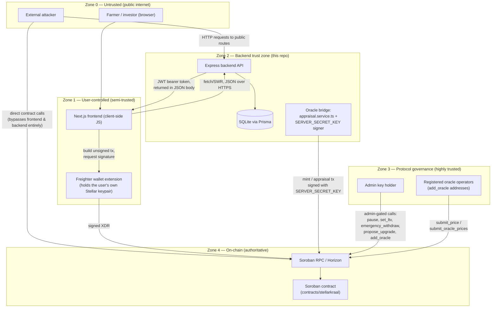

# StellarKraal — System Threat Model

| | |
|---|---|
| **Status** | Draft — pending maintainer review |
| **Methodology** | STRIDE (per-component) |
| **Scope** | Soroban contract · Backend API · Oracle bridge · Frontend · Trust boundaries between them |
| **Modeled against** | This repo `stellar-kraal-backend` @ `1694f7e` (2026-07-16) · upstream reference `teslims2/StellarKraal-` @ `bd19bbd` (2026-07-16) |
| **Owner** | Security / maintainers — see [Review Cadence](#review-cadence) |
| **Related issue** | [#40 — Threat model documentation for the full StellarKraal system using STRIDE framework](https://github.com/Stellar-kraal/stellar-kraal-backend/issues/40) |

## Table of Contents

1. [Executive Summary](#executive-summary)
2. [Scope and Assumptions](#scope-and-assumptions)
3. [System Overview](#system-overview)
4. [Trust Boundary Diagram](#trust-boundary-diagram)
5. [Threat Actor Profiles](#threat-actor-profiles)
6. [Methodology](#methodology)
7. [Threat Catalog](#threat-catalog)
   - [1. Soroban Contract](#1-soroban-contract)
   - [2. Backend API](#2-backend-api)
   - [3. Oracle Bridge](#3-oracle-bridge)
   - [4. Frontend](#4-frontend)
   - [5. Cross-Component / Trust Boundary](#5-cross-component--trust-boundary)
8. [Follow-Up Issues](#follow-up-issues)
9. [Out of Scope](#out-of-scope)
10. [Review Cadence](#review-cadence)
11. [References](#references)

## Executive Summary

| Metric | Count |
|---|---|
| Total threats catalogued | 26 |
| 🔴 HIGH residual risk | 9 |
| 🟠 MEDIUM residual risk | 12 |
| 🟡 LOW residual risk | 5 |
| Follow-up issues required | 8 (see [Follow-Up Issues](#follow-up-issues)) |

Threats by component:

| Component | Threats | HIGH |
|---|---|---|
| Soroban Contract | 8 | 4 |
| Backend API | 8 | 1 |
| Oracle Bridge | 4 | 2 |
| Frontend | 4 | 2 |
| Cross-Component | 2 | 0 |

**Headline findings.** The single largest concentration of risk is that collateral valuation is currently **self-reported and disconnected from the on-chain oracle/TWAP system** the contract otherwise implements carefully (SC-01, SC-02 — this extends a vulnerability already flagged in `docs/security/audit-internal.md`, finding H1). The second largest theme is **key concentration**: one backend Stellar keypair (`SERVER_SECRET_KEY`) simultaneously authenticates users and signs on-chain price/oracle transactions (BE-01), and the contract's `emergency_withdraw` can drain 100% of pooled funds with a single admin signature and no timelock, in contrast to the 24-hour timelock protecting contract upgrades (SC-05). Frontend findings center on a wallet test-mode hook that must be verified absent from production bundles (FE-01) and JWT storage that is very likely vulnerable to theft via XSS (FE-02).

## Scope and Assumptions

This document was written for **this repository** (`Noubata/stellar-kraal-backend`), which contains only the backend component. Producing an accurate, code-grounded model for the other four components required reading real source from the public upstream reference implementation, **`teslims2/StellarKraal-`**, over the network (read-only). The two codebases are **not the same implementation** — differences below are material to several findings and are called out explicitly rather than papered over:

- **Backend framework.** The originating issue text says "NestJS backend." The actual backend (in this repo, and in the upstream reference) is **Express**, not NestJS. This document uses "Express" throughout.
- **No literal "oracle bridge" service exists.** There is no `oracle-bridge/` repo or process. "Oracle bridge" in this document means the off-chain-to-on-chain price/appraisal submission pathway: `src/services/appraisal.service.ts` (this repo) computing an off-chain value, `src/services/soroban.service.ts` (this repo) submitting it on-chain using `SERVER_SECRET_KEY`, and the contract's registered oracle addresses (`add_oracle` / `submit_oracle_prices` / `submit_price`, per [ADR-006](https://github.com/teslims2/StellarKraal-/blob/main/docs/adr/ADR-006-oracle-design.md)).
- **Backend/contract interface drift.** This repo's `soroban.service.ts` calls a `mint_collateral` function and expects a `get_loan_state` shape (`interest_rate_bps`, `duration_days`) that **do not exist** in the upstream contract's actual entry points (`register_livestock`, `request_loan`, `LoanRecord`). Today this means the two would fail to interoperate outright if pointed at each other; it is documented as finding BE-08 rather than silently reconciled, because undetected drift on a funds-moving path is itself a risk category.
- **Citations are marked by origin.** `src/...`, `prisma/...` paths with no prefix are in **this repo**. Paths prefixed `upstream:` are in the public `teslims2/StellarKraal-` reference and do not exist locally — they ground the Contract and Frontend sections, which have no code in this repo to cite.
- **STRIDE, not PASTA.** The issue allowed either; STRIDE was used because the acceptance criteria explicitly require a "STRIDE category" column per threat.
- This is a **point-in-time** model. See [Review Cadence](#review-cadence) for when it must be revisited.

## System Overview

| # | Component | What it is | Where it lives |
|---|---|---|---|
| 1 | **Soroban Contract** | Rust/Soroban lending contract: collateral registration, loan origination, repayment, liquidation, oracle registry, protocol governance. | `upstream:contracts/stellarkraal/src/lib.rs` (not in this repo) |
| 2 | **Backend API** | Express + Prisma/SQLite service: SEP-10 wallet auth, livestock/appraisal endpoints, loan endpoints, Soroban RPC client, on-chain event indexer. | `src/` (this repo) |
| 3 | **Oracle Bridge** | The off-chain appraisal pipeline plus the on-chain submission path that feeds it a price; not a separate service (see [Scope and Assumptions](#scope-and-assumptions)). | `src/services/appraisal.service.ts`, `src/services/soroban.service.ts` (this repo) + contract oracle entry points (upstream) |
| 4 | **Frontend** | Next.js 14 app: Freighter wallet integration, SWR-based API client, transaction construction for direct on-chain calls. | `upstream:frontend/src/` (not in this repo) |
| 5 | **Trust boundaries** | The seams between the above: browser ↔ backend, backend ↔ RPC, backend ↔ contract, admin/oracle ↔ contract, wallet ↔ chain. | N/A — cross-cutting |

## Trust Boundary Diagram

**Trust level summary:**

| Zone | Trust level | Notes |
|---|---|---|
| Zone 0 | None (assume hostile) | Anyone; no credentials required |
| Zone 1 | Semi-trusted | Authenticated as one user via their own Stellar keypair; cannot act for anyone else |
| Zone 2 | Trusted | Holds `JWT_SECRET` and `SERVER_SECRET_KEY`; single point of failure for both user auth and oracle submission (see BE-01) |
| Zone 3 | Highly trusted | Admin key controls protocol parameters and treasury; oracle operator keys control price data |
| Zone 4 | Authoritative | Source of truth for funds and loan state; everything above is a client of it |

## Threat Actor Profiles

### TA-1 — External Attacker (unauthenticated internet actor)

- **Motivation:** Direct financial theft, draining pooled liquidity, gaming collateral valuation for profit, or opportunistic/reputational griefing of a public DeFi protocol.
- **Capability:** No credentials, no registered keys. Can create Stellar accounts freely, call any *public* API route or *public* contract entry point, and can attempt to inject malicious code into the frontend supply chain (dependency compromise, XSS). **Cannot** forge admin or registered-oracle signatures without a leaked key.
- **Primary targets:** BE-06, BE-07, FE-01, FE-02, FE-03, XC-01.

### TA-2 — Malicious or Compromised Oracle Operator

- **Motivation:** Profit from controlling the appraised collateral value that gates borrowing — over-value collateral to over-borrow and default, or otherwise bias pricing for personal advantage.
- **Capability:** Controls a Stellar keypair registered via `add_oracle`, **or** controls the off-chain price source that the "oracle" actually reads from today (the internal static price table in `appraisal.service.ts`, since the second adapter is a permanent stub — see OR-01). Can call `submit_price` / `submit_oracle_prices`. Cannot bypass `require_auth` for anything outside its own signing key.
- **Primary targets:** SC-01, SC-02, OR-01, OR-02, OR-03, OR-04.

### TA-3 — Compromised Admin Key Holder

- **Motivation:** Full protocol takeover: drain the treasury, push a malicious contract upgrade, silently repoint the oracle registry, or freeze the protocol for extortion/griefing.
- **Capability:** Holds (or has stolen) the single `Address` stored as `ADMIN`. Every admin-gated entry point becomes available in one signature: `pause`/`unpause`, `set_ltv`, `set_liquidation_threshold`, `add_oracle`/`remove_oracle`, `update_fee_config`, `propose_upgrade`, `emergency_withdraw`, `propose_new_admin`. Constrained only by the 24-hour upgrade timelock (SC-05 notes `emergency_withdraw` has **no equivalent timelock**) and whatever off-chain key custody practice exists (not itself part of this repo's code).
- **Primary targets:** SC-05, SC-06, BE-01, OR-02.

### TA-4 — Malicious Marketplace Participant (rogue farmer / investor / liquidator)

- **Motivation:** Borrow more than honest collateral value supports and abandon the loan (profit = principal disbursed minus a collateral position never worth reclaiming), or exploit self-reported appraisal directly against the contract, bypassing the backend and frontend entirely.
- **Capability:** Holds an ordinary Stellar keypair and the same contract access as any legitimate user (`register_livestock`, `request_loan`, `repay_loan`, `liquidate`). Critically, this actor is **not limited to the official frontend or backend** — any Soroban RPC client can call the contract directly, so backend-side pre-checks (e.g. the LTV validation in `loans.controller.ts`) are advisory only and do not constrain this actor.
- **Primary targets:** SC-01, SC-03, SC-04, BE-03, BE-08.

## Methodology

**Framework:** STRIDE, applied per-component. Each threat is tagged with the STRIDE category that best characterizes the primary violation (a threat may have secondary characteristics; only the primary is used for the required column).

**Residual risk rating.** A simple qualitative Impact × Likelihood judgment, biased toward Impact given this protocol moves real value:

| | Low Impact | Medium Impact | High Impact (funds at risk, insolvency, full account/session compromise) |
|---|---|---|---|
| **Low likelihood** (needs privileged access or is largely theoretical) | LOW | LOW | MEDIUM |
| **Medium likelihood** (needs a specific precondition: leaked key, XSS, race window) | LOW | MEDIUM | HIGH |
| **High likelihood** (exploitable today, no special access needed) | MEDIUM | HIGH | HIGH |

Every threat below states its **existing mitigation** (with a file citation) before its residual rating — the rating is *after* crediting whatever mitigation already exists.

## Threat Catalog

### 1. Soroban Contract

Grounded in `upstream:contracts/stellarkraal/src/lib.rs` (not present in this repo — see [Scope and Assumptions](#scope-and-assumptions)). The contract has strong foundational controls (checked arithmetic throughout, a `ReentrancyGuard` RAII pattern, two-step admin transfer, a 24-hour upgrade timelock) — several threats below exist *despite* that solid baseline, in the business-logic layer above it.

| ID | STRIDE | Component | Threat | Existing Mitigation | Residual Risk |
|---|---|---|---|---|---|
| **SC-01** | Tampering | Soroban Contract | `register_livestock` and `update_appraisal` accept a caller-supplied `appraised_value`/`new_value` with **no cross-check against any oracle price** — only an optional, admin-configured per-animal-type ceiling. An owner can self-declare an inflated value and borrow against it. | Optional `AnimalCap` ceiling per animal type (`upstream:contracts/stellarkraal/src/lib.rs:505-513`); unset by default at `initialize`. | 🔴 **HIGH** — [FUP-01](#follow-up-issues) |
| **SC-02** | Tampering | Soroban Contract | The multi-oracle median/quorum system and the TWAP mechanism (`submit_oracle_prices`, `submit_price`, `get_twap_data`) are **never read** by `request_loan`, `liquidate`, or `health_factor` (`compute_health_factor_with_thr` uses only the frozen `total_collateral_value`). All the manipulation-resistance engineering described in [ADR-006](https://github.com/teslims2/StellarKraal-/blob/main/docs/adr/ADR-006-oracle-design.md) provides **no actual protection** to lending decisions today. This extends finding **H1** already logged in `docs/security/audit-internal.md`. | None at the loan-logic level; the oracle data exists but is orphaned. | 🔴 **HIGH** — [FUP-01](#follow-up-issues) |
| **SC-03** | Tampering | Soroban Contract | `total_collateral_value` is frozen on `LoanRecord` at origination. `update_appraisal` only mutates the standalone `CollateralRecord` — it never propagates to an already-open loan, so a collateral devaluation post-origination is invisible to solvency/liquidation logic. | Rolling 3-entry `appraisal_history` is tracked (`upstream:contracts/stellarkraal/src/lib.rs:907-916`) but is informational only. | 🟠 **MEDIUM** |
| **SC-04** | Repudiation | Soroban Contract | `compute_health_factor_with_thr` computes `total_debt = outstanding + interest_accrued` but the actual ratio uses **only `outstanding`**, not `total_debt`, in both numerator and denominator (`upstream:contracts/stellarkraal/src/lib.rs:1434-1447`). Interest can accrue without bound and never affects liquidation eligibility — undetectable bad debt. | None — appears to be an unused calculation rather than an intentional simplification. | 🔴 **HIGH** — [FUP-02](#follow-up-issues) |
| **SC-05** | Elevation of Privilege | Soroban Contract | `emergency_withdraw` requires a **single** admin signature plus a paused state and executes **immediately** — no timelock — in contrast to the 24-hour timelock protecting `propose_upgrade`/`execute_upgrade`. A compromised or malicious admin key can drain 100% of pooled funds to any address faster than any code upgrade could. | Requires contract to be paused first (`upstream:contracts/stellarkraal/src/lib.rs:1069-1076`); pausing itself is also single-admin-signature. | 🔴 **HIGH** — [FUP-03](#follow-up-issues) |
| **SC-06** | Elevation of Privilege | Soroban Contract | Admin key compromise risk is partially mitigated by design elsewhere: two-step admin transfer (`propose_new_admin` / `accept_admin_role`, `upstream:contracts/stellarkraal/src/lib.rs:467-489`) prevents a single fat-fingered or unilaterally-forced transfer, and `ReentrancyGuard` (`upstream:contracts/stellarkraal/src/lib.rs:278-297`) closes the classic reentrancy path on `request_loan`/`repay_loan`/`liquidate`. | The two-step transfer and reentrancy guard themselves. | 🟡 **LOW** *(mitigated — recorded as a positive control)* |
| **SC-07** | Denial of Service | Soroban Contract | Pausing the contract (`pause`) blocks `request_loan` and `liquidate` but **intentionally** does not block `repay_loan` (`upstream:contracts/stellarkraal/src/lib.rs:634-635` comment), so borrowers can always exit debt even during an incident freeze. | Explicit design choice, documented in-code. | 🟡 **LOW** |
| **SC-08** | Elevation of Privilege | Soroban Contract | `execute_upgrade` has **no auth check at all** — callable by any address once the 24h timelock elapses (`upstream:contracts/stellarkraal/src/lib.rs:1338-1365`). This is a standard permissionless-execution timelock pattern (the payload was already fixed by an admin-authorized `propose_upgrade`, and `cancel_upgrade` remains admin-gated), not a vulnerability, but is worth an explicit maintainer acknowledgment since it diverges from every other function's pattern. | `cancel_upgrade` is admin-gated (`upstream:contracts/stellarkraal/src/lib.rs:1369-1372`); payload is fixed before the timelock starts. | 🟡 **LOW** *(informational — confirm intentional)* |

### 2. Backend API

Grounded in this repo (`src/`).

| ID | STRIDE | Component | Threat | Existing Mitigation | Residual Risk |
|---|---|---|---|---|---|
| **BE-01** | Elevation of Privilege / Spoofing | Backend API | A single Stellar keypair, `SERVER_SECRET_KEY`, both signs SEP-10 auth challenges (`src/services/auth.service.ts:91`, proving the backend's identity to users) **and** submits on-chain oracle/mint transactions (`src/services/soroban.service.ts:75`). Leaking this one key compromises the authentication trust root and financial oracle authority simultaneously. | `SERVER_SECRET_KEY` is validated to be a well-formed Stellar secret at startup (`src/config/env.ts:80-82`); no other separation exists. | 🔴 **HIGH** — [FUP-04](#follow-up-issues) |
| **BE-02** | Denial of Service | Backend API | `pendingChallenges` (`src/services/auth.service.ts:71`) is an in-memory `Map` with no periodic cleanup for abandoned challenges and does not survive a restart or scale across more than one instance. | Entries are deleted on successful verification or lazily on expiry-check (`src/services/auth.service.ts:160-163`); the module comment itself flags "In production use Redis with TTL." | 🟠 **MEDIUM** |
| **BE-03** | Tampering / Repudiation | Backend API | The idempotency check-then-act sequence (`src/middleware/idempotency.ts:21-34`, `src/services/idempotency.service.ts:22-40`) has a race: on a `P2002` unique-constraint collision the service silently **overwrites** rather than blocking, so two concurrent identical requests can both execute the underlying financial mutation. | Idempotency key + 24h TTL response cache prevents *sequential* duplicate execution. | 🟠 **MEDIUM** |
| **BE-04** | Elevation of Privilege | Backend API | JWTs are stateless (HS256, `src/services/auth.service.ts:43-56`) with a 24h default expiry (`src/config/env.ts:55`) and no server-side revocation/blocklist. A stolen token remains valid for its full lifetime regardless of logout or detected compromise. | Reasonable default expiry; `JWT_SECRET` is covered by the rotation program (`docs/security/secrets-rotation.md`, upstream). | 🟠 **MEDIUM** |
| **BE-05** | Denial of Service / Integrity | Backend API | `registerLivestock`'s `mintCollateral` call is fire-and-forget (`.then()/.catch()`, not awaited — `src/controllers/livestock.controller.ts:119-138`). A crash between the DB write (`APPRAISED`) and transaction confirmation permanently strands the record; there is no reconciliation job. | The `.catch()` handler does mark the record `REJECTED` on an *observed* failure, but a process crash mid-flight is not observed. | 🟠 **MEDIUM** |
| **BE-06** | Information Disclosure | Backend API | `GET /api/livestock/:id` performs **no ownership check** (`src/controllers/livestock.controller.ts:215-257`) — any authenticated user can fetch any other farmer's livestock record and owner profile fields. | Materially the same fields are already public, by marketplace design, via `GET /api/loans/:id` (`src/controllers/loans.controller.ts:95-158`, unauthenticated route). | 🟡 **LOW** |
| **BE-07** | Denial of Service | Backend API | `GET /api/loans/:id?realtime=true` is a **public, unauthenticated** route that triggers a live Soroban RPC `simulateTransaction` on every call (`src/controllers/loans.controller.ts:132-141`, `src/services/soroban.service.ts:197-243`). Only the blanket 500 req/15 min limiter applies (`src/app.ts:48-54`) — no per-route limiter accounts for its RPC cost. | Global rate limiter bounds total request volume. | 🟠 **MEDIUM** |
| **BE-08** | Tampering / Repudiation | Backend API | Interface drift: this repo's `soroban.service.ts` targets a `mint_collateral` function and a `get_loan_state` shape (`interest_rate_bps`, `duration_days`) that **do not exist** on the actual upstream contract (`register_livestock`/`request_loan`, `LoanRecord`). Today this fails closed (RPC calls simply error), but undetected interface drift on a funds-moving integration is a process risk that could silently worsen with future changes on either side. | None — no contract-interface conformance test exists in this repo. | 🟠 **MEDIUM** |

### 3. Oracle Bridge

The off-chain-to-on-chain price/appraisal submission pathway (see [Scope and Assumptions](#scope-and-assumptions)). Grounded in `src/services/appraisal.service.ts` (this repo) and the contract's oracle entry points (upstream).

| ID | STRIDE | Component | Threat | Existing Mitigation | Residual Risk |
|---|---|---|---|---|---|
| **OR-01** | Spoofing / Tampering | Oracle Bridge | The "multi-oracle" median design in `appraisal.service.ts` (`ORACLES` array, `src/services/appraisal.service.ts:170`) has exactly **one real adapter** (`internalOracle`, a static hardcoded price table) and one **permanently-stubbed** adapter (`marketFeedOracle`, always returns `null`, `src/services/appraisal.service.ts:161-167`). A median of one value is just that value — whoever controls the static table (or `SERVER_SECRET_KEY`) fully controls appraisal output, defeating the manipulation-resistance purpose of the design. | Fallback-to-internal-table logic is at least explicit and logged (`src/services/appraisal.service.ts:191-197`); a `confidence` score is exposed. | 🔴 **HIGH** — [FUP-05](#follow-up-issues) |
| **OR-02** | Information Disclosure / Elevation of Privilege | Oracle Bridge | `SERVER_SECRET_KEY` — and any on-chain registered oracle signer key — is **absent** from `docs/security/secrets-rotation.md`'s rotation table (upstream), which covers `JWT_SECRET`, `WEBHOOK_SECRET`, `ADMIN_API_KEY`, and AWS credentials but no Stellar keypair. No defined rotation cadence or emergency-rotation runbook exists for the key with direct pricing authority. | Tracked upstream as an open item (Issue 39, "Secrets Management and Rotation Automation for Oracle Bridge and Backend" — not yet implemented). | 🔴 **HIGH** — [FUP-06](#follow-up-issues) |
| **OR-03** | Tampering | Oracle Bridge | On-chain oracle registration (`add_oracle`/`remove_oracle`, capped at 5, `upstream:contracts/stellarkraal/src/lib.rs:1141-1180`) and quorum (`min(3, oracle_count)`, `upstream:contracts/stellarkraal/src/lib.rs:1222`) require majority collusion to move the median once ≥3 independent real oracles exist. Today it is aspirational, since only one real off-chain adapter exists (ties to OR-01). | Design is sound *if* operationally followed through; documented in [ADR-006](https://github.com/teslims2/StellarKraal-/blob/main/docs/adr/ADR-006-oracle-design.md). | 🟠 **MEDIUM** *(contingent on OR-01/OR-05 remediation)* |
| **OR-04** | Repudiation | Oracle Bridge | `flagged_count` (submissions >50% off the median, `upstream:contracts/stellarkraal/src/lib.rs:1249-1255`) is surfaced on-chain but nothing off-chain automatically monitors or alerts on it — detection depends entirely on manual admin review of chain state. | The signal exists and is queryable via `submit_oracle_prices`'s return value. | 🟠 **MEDIUM** |

### 4. Frontend

Grounded in `upstream:frontend/src/` (not present in this repo — see [Scope and Assumptions](#scope-and-assumptions)).

| ID | STRIDE | Component | Threat | Existing Mitigation | Residual Risk |
|---|---|---|---|---|---|
| **FE-01** | Spoofing | Frontend | `freighterClient.ts` exposes a `window.__STELLARKRAAL_E2E__` hook (`upstream:frontend/src/lib/freighterClient.ts:19-30`) that fully substitutes wallet connect/signing for E2E tests. No build-time guard stripping it from production bundles is visible. If reachable in production, any script able to set that global — XSS, a malicious browser extension, a compromised dependency — can spoof wallet connection and intercept or forge "signed" transactions. | The hook is scoped behind a specifically-named global rather than a generic override, which limits accidental triggering. | 🔴 **HIGH** — [FUP-07](#follow-up-issues) |
| **FE-02** | Information Disclosure | Frontend | The backend issues the JWT in a JSON response body, not a `Set-Cookie: HttpOnly` header (`src/controllers/auth.controller.ts:84-91`, this repo). The frontend must therefore persist it somewhere JS-accessible — consistent with the `localStorage` pattern already used for the wallet address (`upstream:frontend/src/hooks/useWallet.ts:30,50,60`). Any single XSS anywhere in the frontend yields full session takeover, with no `HttpOnly` protection to fall back on. | None identified for token storage specifically. | 🔴 **HIGH** — [FUP-08](#follow-up-issues) |
| **FE-03** | Tampering | Frontend | Non-custodial signing model: the frontend builds transaction parameters and hands them to Freighter for signing. A compromised or malicious frontend build could alter operation parameters before the signing prompt ("blind signing"). | Freighter's own confirmation UI displays the actual operation being signed, independent of the calling page. | 🟠 **MEDIUM** *(residual: most users do not verify raw operation details)* |
| **FE-04** | Elevation of Privilege | Frontend | `middleware.ts` (`upstream:frontend/src/middleware.ts:1-24`) enforces only maintenance-mode redirects — there is no server/edge-level authorization gate for `/admin/*` routes. | Acceptable *only* because real authorization must be enforced by the backend API the admin UI calls, not by route presence — this is a trust-boundary clarification, not a gap, as long as that invariant holds. | 🟡 **LOW** *(informational — confirm no admin data is ever rendered from client-only checks)* |

### 5. Cross-Component / Trust Boundary

| ID | STRIDE | Component | Threat | Existing Mitigation | Residual Risk |
|---|---|---|---|---|---|
| **XC-01** | Denial of Service | Cross-Component | Rate limiting is global (500 req/15 min) with a stricter auth-specific limiter (20 req/15 min, `src/app.ts:48-62`); no route-specific limiter exists for endpoints that trigger RPC-cost work on the backend's behalf (compounds BE-07). | Global + auth-path limiting is a reasonable baseline. | 🟠 **MEDIUM** |
| **XC-02** | Repudiation | Cross-Component | Structured JSON logging exists (`src/lib/logger.ts`) but there is no append-only/immutable audit trail specifically for privileged actions (pause, `emergency_withdraw`, oracle-set changes). Reconstructing "who did what, when" during an incident requires manually correlating on-chain events with off-chain application logs. | On-chain events are emitted for every state-mutating call (`env.events().publish(...)` throughout `upstream:contracts/stellarkraal/src/lib.rs`) and are independently queryable regardless of backend log retention. | 🟠 **MEDIUM** |

## Follow-Up Issues

Per the acceptance criteria, every **HIGH** residual-risk threat has a linked follow-up issue, filed on `Stellar-kraal/stellar-kraal-backend`:

| Follow-up | Threats covered | Issue |
|---|---|---|
| FUP-01 | SC-01, SC-02 | [#60 — Enforce oracle-validated collateral pricing in loan origination and liquidation](https://github.com/Stellar-kraal/stellar-kraal-backend/issues/60) |
| FUP-02 | SC-04 | [#61 — Include accrued interest in the health-factor calculation](https://github.com/Stellar-kraal/stellar-kraal-backend/issues/61) |
| FUP-03 | SC-05 | [#62 — Add a timelock (or multisig) to `emergency_withdraw`](https://github.com/Stellar-kraal/stellar-kraal-backend/issues/62) |
| FUP-04 | BE-01 | [#63 — Separate the backend's SEP-10 auth signing key from its on-chain oracle/transaction submission key](https://github.com/Stellar-kraal/stellar-kraal-backend/issues/63) |
| FUP-05 | OR-01 | [#64 — Implement a real second price oracle adapter, or document single-oracle trust until one exists](https://github.com/Stellar-kraal/stellar-kraal-backend/issues/64) |
| FUP-06 | OR-02 | [#65 — Bring Stellar signing keys into the secrets rotation program](https://github.com/Stellar-kraal/stellar-kraal-backend/issues/65) |
| FUP-07 | FE-01 | [#66 — Strip or hard-gate the `__STELLARKRAAL_E2E__` wallet test hook out of production builds](https://github.com/Stellar-kraal/stellar-kraal-backend/issues/66) |
| FUP-08 | FE-02 | [#67 — Move JWT storage off `localStorage` / evaluate `HttpOnly` cookie-based sessions](https://github.com/Stellar-kraal/stellar-kraal-backend/issues/67) |

## Out of Scope

Per the originating issue:

- Implementing any of the mitigations above (tracked instead as the follow-up issues in the previous section).
- Third-party / external penetration testing.

## Review Cadence

Re-review this document — in full or the affected section — whenever:

- A new component or integration is added (e.g. a real second oracle adapter, a KYC provider per `docs/compliance/kyc-aml-design.md`).
- Any HIGH-rated finding's follow-up issue ships a mitigation (downgrade the residual rating and note the change here).
- The Soroban contract is upgraded (`execute_upgrade`), given several findings (SC-01 through SC-05) are specific to the current contract logic.
- The backend's Soroban integration is updated to match the real upstream contract interface (resolves BE-08 and may change SC-01/SC-02's applicability to this repo directly rather than by reference).

## References

- [Issue #40](https://github.com/Stellar-kraal/stellar-kraal-backend/issues/40) — *Threat model documentation for the full StellarKraal system using STRIDE framework*
- `docs/security/audit-internal.md` (upstream) — prior internal contract audit; this document's SC-02 extends finding H1
- `docs/security/secrets-rotation.md` (upstream) — existing secrets rotation program; gap identified in OR-02
- [ADR-005](https://github.com/teslims2/StellarKraal-/blob/main/docs/adr/ADR-005-collateral-appraisal-model.md) — Off-chain collateral appraisal model
- [ADR-006](https://github.com/teslims2/StellarKraal-/blob/main/docs/adr/ADR-006-oracle-design.md) — Multi-oracle median aggregation for price feeds
- `upstream:contracts/stellarkraal/src/lib.rs` — Soroban contract source (`teslims2/StellarKraal-` @ `bd19bbd`)
- `upstream:frontend/src/` — Next.js frontend source (`teslims2/StellarKraal-` @ `bd19bbd`)
